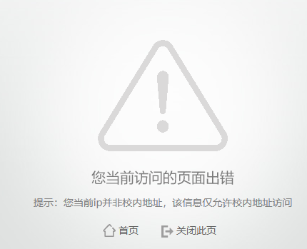

# 关于需要校园网才能登录的网站
在校内，新生实验室安全考试、教务处等单位发布的部分通知公告、党团考试需要使用校园网才允许访问, 否则可能出现包括但不限于以下报错提示:   
但是我没有购买校园网! 这怎么解决呢?   
以下是几种可供参考的解决方案:  
1. 前往笃行楼(尾号18-21的教室)、致广楼的机房, 在机房电脑上通过福Star APP扫码登录后即可接入到校园网。
2. 使用[**福建师范大学VPN服务**(点击此处进入)](https://net.fjnu.edu.cn/43/d4/c5318a82900/page.htm), 但是本服务仅对研究生及教职工开放, 对本科生不开放。
3. 连接到没有密码的校园网WIFI: webportal.fjnu.edu.cn。在连接成功后会弹出登录页面, 请直接无视该页面, 继续访问校内网站即可。(部分手机在WIFI没有进行认证的情况下会自动切换到流量上网, **在连接WIFI时关闭数据流量** 或 在设置中查找并关闭类似于"网络不好时自动切换WIFI"的选项即可)
4. 找别人借/租校园网账号, 然后正常连接。