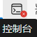
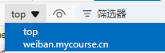
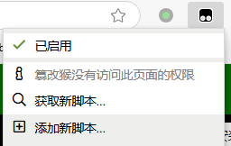

# 新生安全教育速通教程

[**安全微伴(点击进入)**](https://weiban.mycourse.cn/#/login)

## 安全教育课程(84节)

### 简单版

  参考资料: [利用js快速完成大学生新生安全教育课程_CSDN](https://blog.csdn.net/m0_38072683/article/details/118878085)  

* 使用Edge或Chrome浏览器进入安全微伴
* 进入具体的某一节课程后, 在课程页面单击鼠标右键, 点击"检查"打开浏览器调试工具(也可直接按F11按键)
* 打开控制台(Console)
* 在上方页面选择框中选择课程页面`mcwk.mycourse.cn` 
* 在控制台下方的键入命令编辑框中输入JS指令`FinishWxCourse();` 然后回车执行
* 手动完成课程页面的验证码, 课程完成

### 进阶版

  在简单版中需要手动输入指令, 比较麻烦, 我们可以通过油猴脚本省略手动输入JS指令的过程。

* 给浏览器安装油猴(在Edge商店中名为篡改猴)插件, 具体如何安装此处略过, 请自行了解
* 在油猴插件窗口中选择"添加新脚本"
* 删除编辑框中自带的所有代码, 复制粘贴以下代码到编辑框中, 然后点击`文件 - 保存`以保存脚本

  ```
    // ==UserScript==
    // @name         New Userscript
    // @namespace    http://tampermonkey.net/
    // @version      0.1
    // @description  try to take over the world!
    // @author       You
    // @match        https://mcwk.mycourse.cn/course/*
    // @icon         https://www.google.com/s2/favicons?sz=64&domain=mycourse.cn
    // @grant        none
    // ==/UserScript==
    function delayedFunction() {
    finishWxCourse();
    }

    setInterval(delayedFunction, 10000)
  ```

* 在`已安装脚本`中启用刚刚创建的脚本
* 打开安全微伴的课程页面, 每10秒脚本会自动调用JS指令, 此时需要你手动完成弹出的验证码

(根据测试, 10秒一次循环是比较安全的值, 更快的速度会导致检测从而答题失败)

### Plus版

* 使用[微伴辅助工具_GitHub](https://github.com/Coaixy/weiban-tool)

## 安全教育考试

### 简单版

* 在答题时使用百度、大学搜题酱等搜题工具。

### 进阶版(二选一)  

以下方法未经编者测试, 请酌情参考。

* 使用[微伴辅助工具_GitHub](https://github.com/Coaixy/weiban-tool)
* 使用[安全微伴自动考试助手_GitHub](https://github.com/kmoonn/Weiban-Tool)
