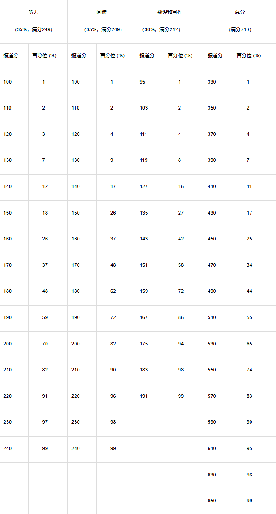
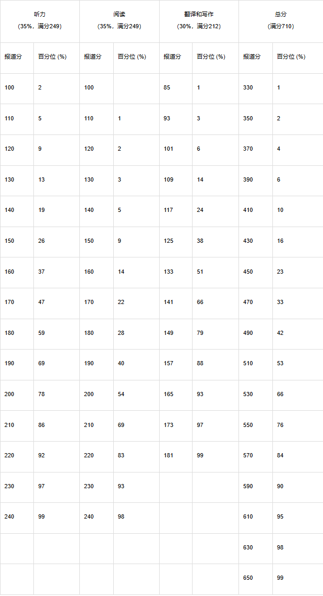

# 全国大学英语四、六级考试分数解释
## 省流版
四、六级考试均为赋分制，满分为710分（听力249分，阅读249分，翻译和写作212分）。卷面分1分约为赋分分数7分。
## 官方版([原文链接](https://cet.neea.edu.cn/html1/folder/19081/5124-1.htm))
 * 全国大学英语四、六级考试（CET）分为四级（CET-4）和六级（CET-6）两个级别。全国大学英语四、六级考试的设计参照了《大学英语课程教学要求》（以下简称教学要求）。四级参照《教学要求》中规定的“一般要求”；六级参照《教学要求》中规定的“较高要求”。大学英语四、六级考试的分数报道采用常模参照方式，不设及格线。四级考试的常模群体选自全国16所高校的约三万名非英语专业的考生；六级常模群体选自全国五所重点大学的约五千名非英语专业的考生。每次考试等值后的卷面分数都参照常模转换为报道分。四、六级考试报道总分为710分，计算公式为：  
   
 公式中TotSco表示总分，X表示每位考生常模转换前的原始总分，Mean表示常模均值，SD表示常模标准差。每次四、六级考试等值后的卷面分数都将参照此常模公式转换为报道分数。 

 * 四、六级考试单项成绩有四个部分，这四个部分以及所占的分值比例为：听力占35%，阅读占35%，翻译和写作占30%。各单项报道分的满分为：听力249分，阅读249分，翻译和写作212分。各单项报道分之和等于报道总分。

 * 每位考生的报道分在常模群体中都有一个相应的百分位位置。下面的表1和表2是大学英语四、六级考试报道分数常模百分位对照表。举例说明表1的使用方法如下（表2的使用方法和表1相同）。
   * 例1：某考生四级报道总分是450分，从表1可以查到其在常模群体中的相应百分位是25%，表示这名考生的英语成绩优于常模群体中25%的人，但劣于75%的人。
   * 例2：某考生四级报道总分是500分，从表1可以查到其在常模群体中的相应百分位在44%～55%之间，表示这名考生的英语成绩至少优于常模群体中44%的人，但不会优于55%的人。
   * 例3：某考生四级报道的听力单项分是140分，从表1可以查到其在常模群体中的相应百分位在12%，表示这名考生的听力成绩优于常模群体中12%的人。
   * 例4：某考生四级报道的阅读单项分是140分，从表1可以查到其在常模群体中的相应百分位在17%，表示这名考生的阅读成绩优于常模群体中17%的人。

表 1：大学英语四级考试报道分数的常模百分位对照表

表 2：大学英语六级考试报道分数的常模百分位对照表
