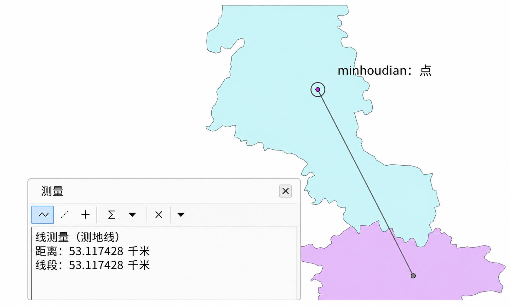
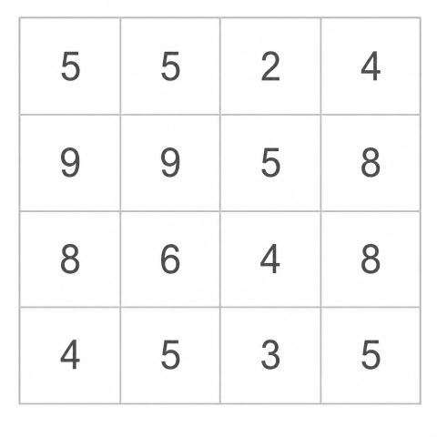
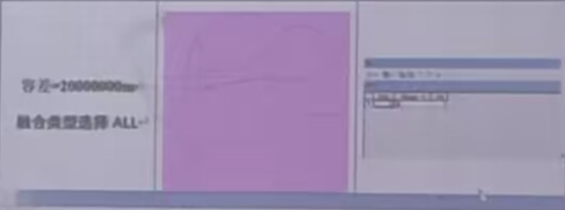
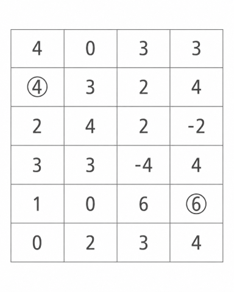
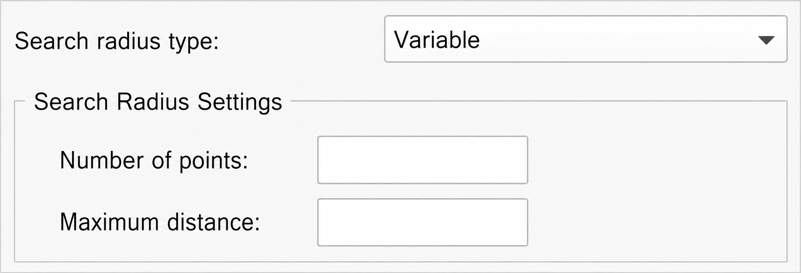
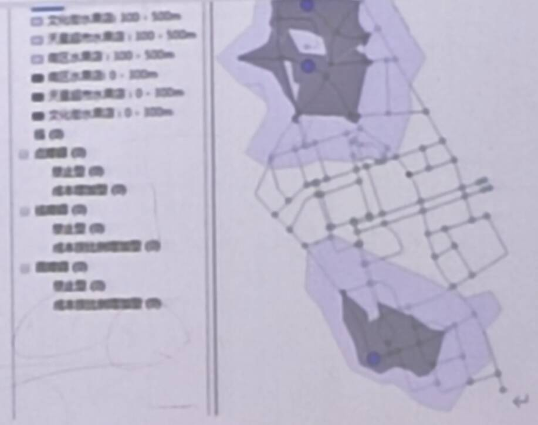

# 2024-2025学年《GIS空间分析》期末考试

- 卷型：A 卷、开卷
- 任课老师：林广发
- 考试时长：120 分钟

部分图片使用 GPT-Image-2 进行修复和重绘。[@Xuuyuan](https://github.com/Xuuyuan)

## 一、计算与简答题（8题，每题8分，共64分）

1. For real estate surveying, what is the appropriate tolerance setting for XY coordinates? Please choose the most appropriate one from the four options: 1m, 0.1m, 0.01m, and 0.001m, and explain the reason.

2. In an experimental report, it was described that "the distance between Fuqing and Minhou is 53.117428 kilometers". Please provide your writing and briefly describe the sources of error in this distance value (Fig. 1).
    
    Fig. 1 Distance Measurement

3. Please calculate the slope of each cell in the grid (Fig. 2), wherein both the unit of cell size and elevation is meter.

4. Please calculate the semivariance function values γ(1) and γ(2) based on the variations in the north-south and east-west directions according to Fig. 2.

    
    Fig. 2 Slope Calculation

5. Please give an example to illustrate what is the First Law of Geography.

6. In an experiment, the buffer analysis results are shown in Fig. 3. Please explain why the buffer is a rectangle.

    
    Fig. 3 Buffer Analysis

7. Please calculate and draw the minimum cost path between the two circled grid cells in Figure 4.

    
    Fig. 4 Cost Path Calculation

8. Why is it necessary to limit the search radius or the minimum number of sample points involved (Fig. 5) among various spatial interpolation methods?

    
    Fig. 5 Setting of Search Radius

## 二、应用与论述题（2题，共36分）

1. A student calculated the 300m and 500m delivery service areas for 3 fruit stores on campus (Fig. 6). Please briefly describe the calculation principle (5 points). If converting to 5-minute and 10-minute delivery areas, how should the calculation be performed? Briefly describe the principle and operation process (10 points). Please list 5 factors affecting the time-based areas. (5 points)

    
    Fig. 6 Network-Based Service Area Analysis

2. Please discuss the relationship between Spatial Analysis and Digital City, Smart City, Internet of Things, Digital Twin. (16 points)
