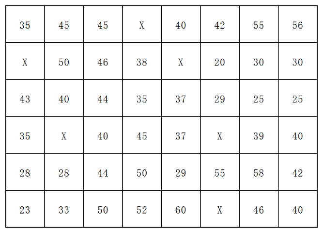
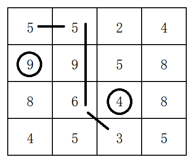
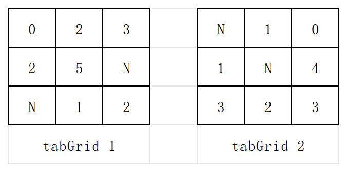

# 2025-2026学年《GIS空间分析》期末考试

- 试卷类型：A 卷、开卷
- 任课老师：林广发，福建师范大学地理科学学院
- 考试时间：2026年6月24日 14:30-16:30，共 120 分钟

本份试卷为回忆版，题目为原卷总体意思、并非原卷原文。[@Xuuyuan](https://github.com/Xuuyuan)

## 一、计算与简答题（6题，共64分）

1. 图1中共有48个采样点，每个采样点间隔1km。请你计算东北-西南方向、间隔1个样本的半变异系数，写出计算过程（8分）；若不分方向，请大约估计该区域的Sill值，并给出依据（7分）。

    
    图1 某正交采样点分布图

2. 写出所示网络的最小生成树（6分），计算该生成树的权值（2分）。举例说明其应用（7分）。 **（许愿注：数字3和1指网格对应边的长度）**

    
    图2 网络图

3. 请计算以下DEM中画圈单元的坡度（保留到小数点后1位，单位为角度），给出公式和主要计算步骤（6分）。设该DEM为成本矩阵，请计算所给出的路径的成本（6分）。

    
    图3 DEM矩阵

4. 请说明为什么下表中的文件大小为2.04MB，并给出计算过程（6分）。

    | 属性 | 属性值 |
    | --- | --- |
    | 列,行 | 511,696 |
    | 波段数 | 3 |
    | 像元大小(X,Y) | 10,10 |
    | 未压缩大小 | 2.04MB |
    | 网格 | ENVI |
    | 源类型 | 通用型 |
    | 像元类型 | 无符号整数型 |
    | 像元深度 | 16位 |

5. 图层A、B的示意图及各自的属性表分别如下。现需要将图层A、B叠置，图层B作为输入图层、图层A作为identity图层。请你完善合并后的属性表。

    
    图4 图层A、B示意图

    | FID | Shape | NAME_TOWN |
    | --- | --- | --- |
    | 0 | Polygon | i |
    | 1 | Polygon | j |

    图层A属性表

    | FID | Shape | NAME_TOWN |
    | --- | --- | --- |
    | 0 | Polygon | 0 |
    | 1 | Polygon | 1 |
    | 2 | Polygon | 2 |
    | 3 | Polygon | 3 |
    | 4 | Polygon | 4 |

    图层B属性表

    | FID | FID.A | FID.B | NAME_TOWN | TYPE |
    | --- | --- | --- | --- | --- |
    | - | - | - | - | - |

    合并后的属性表

6. 计算：1) tabGrid1 && tabGrid2 （4.5分）；2) tabGrid1 DIFF tabGrid2（4.5分）。**（N = No Data）**

    
    图5 tabGrid

## 二、论述题（2题，共36分）

1. 空间插值有三个常用方法：泰森多边形法、IDW法、Kriging法。请分别对其两两进行比较，写出各自的优缺点（每点7分，共21分）。
2. 在AI时代发展的大背景下，请写出空间分析未来可能的3个发展方向（共12分）。