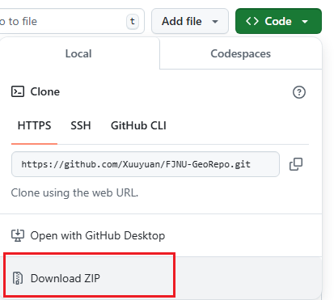

# 福建师范大学 地理科学专业课程资料存档
## [仓库地址](https://github.com/Xuuyuan/FJNU-GeoRepo)
**点击上方蓝色链接即可访问。受部分原因影响, GitHub在有时候可能出现无法访问的情况, 请使用科学上网。**
## 仓库介绍
本仓库文件适用于 **地理科学类 / 地理信息科学 / 自然地理与资源环境 / 人文地理与城乡规划 / 地理科学** 专业的本科学生。  

部分课程文件来源于**QQ: 地科院地理教学交流群(546707786)**, 其余文件为本人在修读 **地理信息科学** 专业时的相关课程资料或自行收集的资料。  
仅作存档, 更新不定, 自行取用。  
  
若有意贡献资料, 可以提交 Pull requests 或联系邮箱 nexfoun@gmail.com , 诚挚感谢。  

## 使用方法
### 前置条件！
请自备科学上网条件, 否则可能出现访问慢或无法访问GitHub站点的情况。
### 在线预览
在GitHub上只能够在线预览Markdown文件(即后缀名为.md的文件)和PDF文件(即后缀名为.pdf的文件, 无法正常预览时请关闭浏览器插件), Word文件(即后缀名为.doc/.docx的文件)、Excel文件(即后缀名为.xls/.xlsx的文件)和PowerPoint文件(即后缀名为.ppt/.pptx的文件)需要下载后浏览。  

由我所提供的文件都会尽量使用Markdown格式, 若需要下载后在本地浏览则需要支持Markdown的阅读器才能正常显示内容。安卓手机可以使用Obsidian, Windows电脑可以使用VS Code、Obsidian、MarkText、Typora等。
### 下载项目的所有资料
↓ 在本仓库页面的右上角找到此按钮(由于文件中含有电子书, 需要下载的文件体积较大, 不建议采用此方法)  

### 下载文件夹(也可用于下载所有资料或单个文件)
1. 打开网站：[GitHub 「特定」文件夹或文件下载工具](https://blog.luckly-mjw.cn/tool-show/github-directory-downloader/index.html)  
2. 复制想要下载的文件夹页面的链接, 粘贴到上面网站的编辑框中
3. 点击「解析下载」, 待网站解析完成后会自动下载压缩包

### 下载单个文件
1. 打开具体要下载的文件
2. 在某个文件的右上角找到此按钮  
