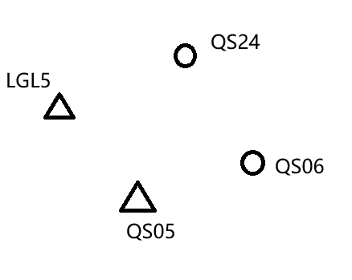

# 24-25-2 《卫星导航定位技术应用》期末试卷（回忆版）

该试卷为回忆版，部分选项有所缺漏，部分题目尚不完整（但不影响理解）。记忆受限，选择题选项顺序与原卷不同。[@Xuuyuan](https://github.com/Xuuyuan)

## 一、填空题（每空 1 分，共 17 分）

1. GPS系统由\_\_\_\_\_\_、\_\_\_\_\_\_、\_\_\_\_\_\_三部分组成。
2. 广播星历是对应某一时刻的\_\_\_\_\_\_及\_\_\_\_\_\_，描述\_\_\_\_\_\_的信息。
3. 定义时间系统，要定义时间的\_\_\_\_\_\_和\_\_\_\_\_\_。
4. 北斗三号导航卫星系统设计有\_\_\_\_\_\_颗卫星，其中 3 颗 GEO(地球静止轨道) 卫星、3 颗\_\_\_\_\_\_卫星和 24 颗\_\_\_\_\_\_卫星。
5. GPS 信号的基本组成部分（信号分量）为：\_\_\_\_\_\_、\_\_\_\_\_\_、\_\_\_\_\_\_。
6. 单站差分根据基准站发送的不同信息可分为：\_\_\_\_\_\_、\_\_\_\_\_\_与\_\_\_\_\_\_。

## 二、单项选择题（每题 2 分，共 20 分）

1. 伽利略系统是由下列哪个国家或机构建立的？
    A. 美国 B. 中国 C. 欧盟 D. 俄罗斯
2. 下列卫星导航定位系统中，不属于被动式导航定位系统的是？
    A. GPS B. GLONASS C. 伽利略(Galileo) D. 北斗一代卫星导航定位系统
3. 下列要素中哪个不属于直角坐标系定义的素？
    A. 坐标系的原点 B. 单位长度(尺度) C. 三轴指向 D. 椭球体大小
4. 在对卫星所有的作用力,可以将其分为中心引力和摄动力。如果将中心引力视为 1，则摄动力大约为多少？
    A. $10^{-2}$ B. $10^{-5}$ C. $10^{-4}$ D. $10^{-3}$
5. 在天球坐标系和地球坐标系的转换中需要注意什么？
    A. 岁差 B. 章动和极移 C. 钟差 D. 【忘了】
    **注：本题 A、B 选项为原卷选项，C 选项为依照记忆还原**
6. GPS 卫星的位置可以根据下列哪项信息计算得到？
    A. Y码  B. 卫星星历  C. 接收机钟差  D. C/A码
    **注：本题 A、B、D 选项为原卷选项，C 选项为依照记忆还原**
7. 周跳是 GNSS 测量中存在于哪种观测值中的误差现象？
    A. 载波相位观测 B. 对流层延迟 C. 卫星钟差 D. 多路径效应
8. 下列 GNSS 测量定位方法分类中，按定位时效分类的是？
    A. 相对定位   B. 差分定位   C. 实时定位   D. 动态定位
    **注：本题 C、D 选项为原卷选项，A、B 选项为依照记忆还原**
9. 下列 GPS 接收机类型中，按用途分类的是？
    A. 导航型接收机   B. 平方型接收机   C. 单频接收机   D. 混合型接收机
10. 在 GIS 数据中，数据字典的主要作用是什么？
    A. 【忘了】 B. 【忘了】 C. 定义数据的属性 D. 【忘了】

## 三、名词解释（每题 3 分，共 15 分）

1. 受摄运动
2. 卫星导航
3. 绝对定位
4. 整周未知数
5. 无约束平差

## 四、简答题（6 题，共 31 分）

1. 北斗建设分为“三步走”是哪三个阶段？每个阶段的目标是什么？（9 分）
2. 有一份 RINEX 格式的文件名为 QS011551.25O ，请问文件名中的每个部分分别代表什么？（5 分）
3. 简述 GPS 定位的基本原理。（5 分）
4. 为什么要进行载波重建？列举出三种载波重建的方法。（5 分）
5. 动态定位的方式有哪三种？（3 分）
6. 列举出几种消除或减弱 GPS 定位误差的方法。（4 分）

## 五、计算题（共 17 分）

1. 由于某种原因使接收机无法保持对卫星信号的连续跟踪时，在卫星信号重新被锁定后，整周计数不会与前面的值保持连续，这一现象称为整周跳变。高次差法是探测和修复周跳的一种方法，下表 1 是对某颗卫星进行连续观测的 8 个历元的载波相关观测值，试用四次差法，探测出周跳发生的历元\_\_\_\_\_\_和发生的周跳数\_\_\_\_\_\_。要求写出过程。（9 分）

    表 1 载波相位观测值数据表

    | 观测历元 | 原始载波相位观测值 |
    | --- | --- |
    | t1 | 475833.23 |
    | t2 | 487451.98 |
    | t3 | 499460.55 |
    | t4 | 511871.43 |
    | t5 | 524426.66 |
    | t6 | 537638.85 |
    | t7 | 551270.89 |
    | t8 | 565314.88 |

    **注：本题题目来自学习通作业，在记忆时仅记录了 t1 的值及 t5 的值。经核验，试题中 t1 的值与学习通原题相同，试题中 t5 的值为 524426.66 ，而学习通内题目为 524416.66 。该表格中的原始载波相位观测值为依照记忆还原。**

2. 现有三台 GNSS 接收机（编号为 001、002、003），需对如图 1 所示的测区控制点进行观测，其中点 LGL5、QS05 为已知点，其它为未知点，观测要求采用边连式静态测量。（8 分）
    ① 请设计该控制网图。
    ② 请写出观测计划（每个时段，三台接收机分别安置在哪些点上观测）。
    
