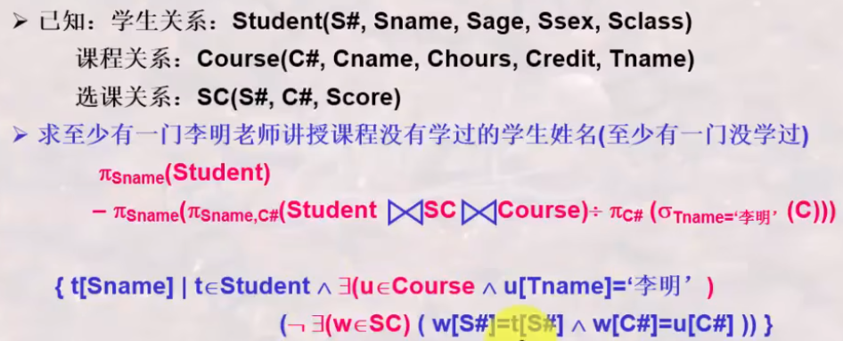

# 数据库原理与应用 复习资料

自用，仅记录教学内容，不包含粗略带过的学习内容。[@Xuuyuan](https://github.com/Xuuyuan) 2024.12.25
部分特殊标注：

- \* 指代本章节为课本上有标注的选学内容
- \*\* 指代本章节为个人认为的无需学习内容。
- ！ 指代本人认为的重点考察内容。
- 被删除的章节：
  - 1.5 *数据库系统的体系结构
  - 4.4 **审计
  - 4.5 **数据加密
  - 4.6 **其他安全性保护
  - 5.6 *域的完整性限制
  - 6.4 **保持函数依赖的模式分解
  - 6.5 *无损连接的模式分解
  - 7.6 **数据库的实施和维护
  - 第八章及之后的内容为未教学或明确表示不作为考点的内容。

## 第一章 绪论

### 1.1 数据库系统概述

#### 数据库的地位

数据库技术产生于六十年代末，是数据管理的最新技术，是计算机科学的重要分支。

#### ！四个基本概念

- 数据(D)
  - **数据是数据库中存储的基本对象，是描述事务的符号和记录**
  - 种类：分为文字、图形、图象、声音
  - 特点：数据与其语义是不可分的
- 数据库(DB)
  - 定义：**长期储存在计算机内、有组织的、可共享的大量数据集合**（即电子化信息的集合）
  - 特征：**数据按一定的数据模型组织、描述和储存，可为各种用户共享，冗余度较小，数据独立性较高，易扩展**
- 数据库管理系统(DBMS)
  - 是位于用户与操作系统之间的一层数据管理软件。
  - 用途：**科学地组织和存储数据、高效地获取和维护数据**
  - 主要功能
    - 数据定义功能：提供数据定义语言(DDL)定义数据库中的数据对象
    - 数据组织、存储和管理功能
    - 数据操纵功能：提供数据操纵语言(DML)操纵数据，实现对数据库的基本操作（**增删改查**：插入、删除、更新、查询）
    - 数据库事务的管理和运行管理
    - 数据库的建立和维护功能
    - 可以概括为**数据库定义、数据库操纵、数据库控制、数据库维护**
- 数据库系统(DBS)
  - 是指在计算机系统中引入数据库后的系统构成
  - **由数据库、数据库管理系统、应用程序、数据库管理员组成的存储、管理、处理和维护数据的系统**

#### 数据管理技术的产生与发展

数据管理技术的三个阶段

- 人工管理阶段：无操作系统、面向某一现实世界、不共享且冗余度极高
- 文件系统阶段：有文件系统、面向某一应用、共享性弱冗余度高
- 数据库系统阶段：有数据库管理系统、面向现实世界、共享性强冗余度低且易扩充

数据库系统阶段数据的特点

- 整体数据的结构化
- 数据的共享性强、冗余度低且易于扩充
- 数据的独立性强
  - **物理独立性：应用程序与数据库中的数据相互独立**
  - **逻辑独立性：应用程序与数据库的逻辑结构相互独立**
- 数据由数据库管理系统统一管理和控制

DBMS对数据的控制功能

- 数据的安全性保护
- 数据的完整性检查
- 并发控制
- 数据库恢复

总结出数据库的定义：**数据库是长期存储在计算机内的有组织、可共享的大量数据的集合。它可以供各种用户共享，具有最小的冗余度和较强的数据独立性。**

### 1.2 数据模型

数据模型就是现实世界的模拟。  
数据模型的两个不同层次

- 概念模型
- 数据模型（分为网状模型、层次模型、关系模型）

**对客观对象的抽象过程就是先将其抽象为概念模型，再将其抽象为数据模型。**  
数据模型的组成要素：数据结构、数据操作、数据的完整性约束条件

#### ！数据模型的组成要素

三个组成要素

- 数据结构：描述数据库的组成对象及对象之间的关系
- 数据操作：对数据库中各种对象的实例允许执行的操作（增删改查）及有关规则
- 数据的约束条件：一组完整性规则的集合

#### 概念模型

信息世界中的基本概念

- 实体：客观存在并可相互区别的事物称为实体。
- 属性：实体所具有的某一特性称为属性。
- 码：唯一标识实体的属性集称为码。
- 域：属性的取值范围称为该属性的域。
- 实体型：用实体名及其属性名的集合来抽象和刻画同类实体称为实体型。
- 实体集：同型实体的集合称为实体集。
- 联系：现实世界中事物内部以及事物之间的联系在信息世界中反映。
  - 一对一的联系、一对多的联系、多对多的联系

概念模型的表示方法：E-R图

- 实体型：矩形，矩形框内写明实体名
- 属性：用椭圆形表示，与实体连接

常用的其它非关系模型

- 层次模型（仅有一个根节点，其它节点都只有一个父结点，只能处理一对多的实体联系）
- 网状模型（允许有多个根结点，其它节点可以有多个父节点，只能直接处理一对多的实体联系，且结构复杂）
- 关系模型（目前主要采用的模型）

#### ！关系模型

关系模型的基本概念

- 关系：即表格
- 元组：即表中的一行
- 属性：表中的一列即为一个属性
- 主码：表中的某个属性组使其唯一确定一个元组
- 域：属性的取值范围
- 分量：元组中的一个属性值

对关系的描述：ep. 学生(学号，姓名，年龄，性别，系，年级)  
关系的每一个分量必须是一个不可分的数据项（此亦为1NF的要求）  
关系模型的数据操纵：增删改查  
关系模型的完整性约束：实体完整性、参照完整性、用户定义的完整性（后面有介绍）  

关系模型的优点

- 概念单一，数据结构简单清晰
- 具有更高的数据独立性
- 简化了程序员和数据库开发建立的工作

关系模型的缺点

- 查询效率往往不如非关系模型
- 为提高性能，需要优化用户的查询请求，增加了开发的难度

### 1.3 数据库系统的三级模式结构

#### 数据库系统模式的概念

- 型：对某一类数据的结构和属性的说明
- 值：是型的一个具体赋值
- 模式：数据库逻辑结构和特征的描述，反映数据的结构及其联系
- 模式的一个实例：反映数据库某一时刻的状态

#### ！三层模式结构、两层映像

- 数据库中全体数据的逻辑结构和特征描述。
- 外模式：数据库用户使用的局部数据的逻辑结构和特征的描述。
- 概念模式: 数据之间内在的本质的联系(全局性的)。  
- 内模式：数据物理结构和存储方式的描述，是数据在数据库内部的表示方式（一个数据库只能有一个）
- E-C 外模式/模式映像: 外模式映射为概念模式的映像, 实现转换, 便于用户观察和使用。  
- C-I 模式/内模式映像: 概念模式映射为内模式的映像, 便于计算机存储和数据的处理。  

### 1.4 数据库系统的组成

数据库系统由硬件平台（数据库、数据库管理系统）、软件平台（数据库应用）、人员（主要是数据库管理人员）组成。  
\*\*人员又分为数据库管理员、系统分析员、数据库设计人员、应用程序员、用户。

## 第二章 关系模型

### 2.1 关系模型的数据结构及形式化/2.2 关系操作/2.3 关系的完整性

#### ！关系

现实世界的实体及实体间的各种联系均用关系来表示。  

- 首先定义 列 的取值范围 域(一组值的集合), 集合中元素的个数称为域的基数。
- 定义元组及所有可能组合成的元组: **笛卡尔积**(根据N个域形成的所有可能的n-元组的集合)。笛卡尔积的每个元素(d1,d2,...,dn)称为一个n-元组, 每个值di叫做一个分量。
- 关系: 一组域的笛卡尔积的子集(笛卡尔积中抽出来的有意义的组合), 此时列名(对关系当中这一列的含义取名)称为属性名。
- 小概念 基数：一组域的笛卡尔积的元组数量。
- 小概念 目/度：一组域的属性数量。

关系中的概念

- **候选码**: 关系中的一个属性组, 其值能**唯一标识**一个元组。(从该属性组中去掉任何一个属性都不再具有这个特性)这样的属性组称为候选码。有时关系中有很多组候选码。
- **全码**: 所有属性构成这个关系的候选码(最极端的情况)。
- **主码(主键)**: 从若干候选码中选定一个作为主码, DBMS以主码为主要线索管理关系中的元组。
- **主属性与非主属性**: 包含在任何一个候选码中的属性称为主属性。
- **外码(外键)**: 是关系R中的属性组但不是候选码, 但其与另一个关系S的候选码相对应。两个关系之间通常靠外码连接。**外码是连接两个或多个关系的纽带**。

关系模型的三要素

- **基本结构**: Table  
- **基本操作**: 并、差、广义积、选择、投影、交、连接、除  
- **！完整性约束**
  - 实体完整性：关系的主属性中的属性值不能为空值
  - 参照完整性：外码可以为空值，但不为空值时必须是外表的主码
  - 用户定义完整性：针对某一具体关系数据库的约束条件，反映应用领域需要遵循的约束条件

关系操作的特点：集合的操作方式，操作的对象和结果都是集合

关系数据语言的种类

- 关系代数语言
- 关系演算语言
  - 元组关系演算语言(谓词变元的基本对象是元组变量 ALPHA/QUEL)
  - 域关系演算语言(谓词变元的基本对象是域变量 QBE)
- 具有关系代数和关系演算双重特点的语言(SQL)

#### 关系模式

关系模式是对关系的描述，其是稳定的(结构), 而关系是某一时刻的值, 是随时间可能发生变化的。
关系模式通常可以简要记为R(U)或R(A1,A2,...,An)。

#### 关系数据库

在一个给定的应用领域中，所有实体及实体之间联系的关系的集合构成一个关系数据库。  
依然需要满足三类完整性约束：实体完整性、参照完整性、用户定义的完整性（前两者是关系模型必须满足的完整性约束条件）

### 2.4 ！关系代数

关系代数是一种抽象的查询语言，用对关系的运算来表达查询。
**关系代数运算的三个要素**

- 运算对象：关系
- 运算结果：关系
- 运算符  

  - 集合运算符（并、交、差、广义笛卡尔积）
  - 专门的关系运算符（选择、投影、除、连接）
  - 算术比较符（大于、小于、等于、不等于等）
  - 逻辑运算符（非、与、或）

- 并(*并相容) R∪S = S∪R: 将两个关系的元组合并成一个关系, 在合并时去重。用于查询XXX、XXX中至少参加了一个的信息。
- 交(*并相容) R∩S = S∩R = R-(R-S) = S-(S-R): 由同时出现在关系R和关系S中的元组构成, 用于查询既参加XXX又参加XXX的信息。
- 差(*并相容) R-S / S-R: 是...但不含..., 用于查询只参加XXX而未参加XXX的信息。
- 广义笛卡尔积 R×S = S×R: 关系R中的元组与关系S中的元组进行所有可能的组合拼接构成。拼接后元组数目相乘, 度数相加。用于检索涉及多个表时串接的运算。是后续学习各种连接运算的基础。
-
- 选择 σcon(R): 从关系R中选择出满足给定条件condition的元组构成。
- 投影 ΠA(R): 从关系R中选出属性包含在A中的列构成, 在合并时去重(因为对于关系来讲是集合, 在实际运用时默认不去重)。
- 除 R÷S: 查询...全部的/所有的..., 要求除属性集S是被除属性集R的真子集。结果的度数k=n-m。  
   验证方法: (R÷S)×S的元组都在R的元组中。  
   ep: 查询选修了全部课程的学生的学号。
- θ-连接(theta-join): R与S的θ连接运算结果也是一个关系。(可以理解为对笛卡尔积添加筛选条件)
- 等值连接(equi-join): θ-连接的特殊情况, 筛选条件中采用等值。
- 自然连接(natural-join): 等值连接的特殊情况, 要求关系R和关系S必须有相同的属性组B。R,S属性相同, 值必须相等才能连接。要在结果中去除重复的属性列。(实际上是最普遍使用的连接)

\*\*部分扩展操作

- 更名 ρSC1(SC): 对表格进行更名以作为筛选条件的辅助操作。
- 外连接(outer-join): 与θ-连接相比, 连接时不会丢失元素(失配信息记为空值)。又进一步细分为左外连接、右外连接、全外连接。

四个最复杂的例子（忽略图下半部分的关系元组演算部分）

1. "全都学过"
  
2. "全没学过"
  
3. "至少有一学过"
  
4. "至少有一没学过"
  

### 2.5 *关系演算

#### 三种关系运算的观点

- 关系运算有三种: 关系代数、关系元组演算和关系域演算
- 三种关系运算都是抽象的数学运算, 体现了三种不同思维(以元组、集合、域变量为对象)
- 三种运算之间是(有条件: 即安全的元组/域演算表达式)等价的
- 三种运算都可以说是非过程性的: 域演算>元组演算>关系代数
- 三种关系运算虽然是抽象的, 但是是衡量数据库语言完备性的基础
- 数据库语言可以基于这三种抽象运算来设计

## 第三章 ！关系数据库标准语言SQL

### 3.1 SQL概述

SQL语言的特点

- 综合统一（SQL语言是集DDL、DML、DCL于一体的数据库语言）
- 高度非过程化（怎么做-做什么）
- 面向集合的操作方式
- 以同一种语法结构提供两种使用方法
- 语言简洁，易学易用
  - SQL语言主要由9个单词引导的操作语句构成:
  - **DDL**: Create, Alter, Drop - 模式的定义和删除
  - **DML**: Insert, Delete, Update, Select - 各种方式的更新与检索操作
  - **DCL**: Grant, Revoke - 安全性控制

- SQL模式创建的基本语法：CREATE SCHEMA 模式名 AUTHORIZATTION 用户名
- SQL模式删除的基本语法：DROP SCHEMA 模式名 [CASCADE|RESTRICT]（级联或约束）

### 3.2 数据定义

| 操作对象 | 创建 | 删除 | 修改 |
| --- | --- | --- | --- |
| 表 | CREATE TABLE | DROP TABLE | ALTER TABLE |
| 视图 | CREATE VIEW | DROP VIEW | 无 |
| 索引 | CREATE INDEX | DROP INDEX | 无 |

- 定义语句格式：CREATE TABLE 表名 (列名 数据类型 [列级完整性约束条件], ... [, 表级完整性约束条件])
  - 常用完整性约束
    - 主码 PRIMARY KEY（不能为空值，可以作为其它表的外键）
    - 唯一性约束 UNIQUE（可以为空值）
    - 非空值约束 NOT NULL
    - 参照完整性约束 FOREIGN KEY
  - 基本数据类型
    - INTEGER 整数，FLOAT 浮点数
    - CHAR(n) 定长字符串，VARCHAR(n) 变长字符串
    - DATE/TIME/DATETIME 时间
- 修改基本表格式：
  - 添加新列：ALTER TABLE 表名 ADD 新列名 数据类型 [完整性约束]
  - 删除列或完整性约束：ALTER TABLE 表名 DROP **COLUMN 列名/完整性约束名**
  - 修改数据类型：ALTER TABLE 表名 MODIFY 列名 数据类型
- 删除表：DROP TABLE 表名（会删除建立在数据和表上的视图和索引）

**建立索引是加快查询速度的有效手段。**

- 建立索引：CREATE [UNIQUE] [CLUSTER] INDEX 索引名 ON 表名(列名 [次序][, 列名[次序]...])
  - 索引可以建立在表格的一列或多列上
  - 索引次序：ASC 升序 DESC 降序，默认的缺省值为升序
  - UNIQUE：唯一性约束（对于已含重复值的列不能建立）
  - CLUSTER：聚簇索引（适用于很少对基表进行增删操作的情况）
- 删除索引：DROP INDEX 索引名

### 3.3 ！数据查询

语句格式：SELECT [ALL|DISTINCT] <目标列表达式>
FROM <表名或视图名>[, <表名或视图名>]
[WHERE <条件表达式>]
[GROUP BY <列名1> [HAVING<条件表达式>]]
[ORDER BY <列名2> [ASC|DESC]]

- SELECT：指定显示的属性列
- FROM：指定查询对象（基本表或视图）
- WHERE：指定查询条件
- GROUP BY：分组
- HAVING：仅能用于分组后，筛选出满足指定条件的组
- ORDER BY：对查询结果按指定列值升序ASC（空元组最后）或降序DESC（空元组最先）排序，缺省值为ASC
- ALL|DISTINCT：DISTINCT为在结果中消除重复集合，缺省值为ALL
- 查询条件

    | 查询条件 | 谓词 | 备注 |
    | --- | --- | --- |
    | 比较 | =,>,<,!=,>=,<=等 | 对两个值进行比较 |
    | 确定范围 | (NOT) BETWEEN ... AND ... | 一般对值进行 |
    | 确定集合 | (NOT) IN | 前者为字符串或值，后者为集合 |
    | 字符匹配 | (NOT) LIKE '字符串' | 字符串中%为匹配任意长度字符串，_为匹配任意单个字符，另有 ESCAPE '字符串' 作为转义字符（个人认为了解即可） |
    | 空值 | IS (NOT) NULL | 空字符串和空值不等同 |
    | 多重条件连接符 | AND, OR | 连接多个条件，AND的优先级大于OR，可以用括号改变优先级 |

- 主要集函数（用于表达式中）
  - 计数：COUNT([DISTINCT|ALL] *|列名)
  - 计算总和： SUM([DISTINCT|ALL] 列名)
  - 计算平均值： AVG([DISTINCT|ALL] 列名)
  - 最大值：MAX([DISTINCT|ALL] 列名)
  - 最小值：MIN([DISTINCT|ALL] 列名)
  - DISTINCT用于去除重复值，ALL为缺省值
- 分组
  - GROUP BY 子句的作用对象是查询的中间结果表
  - 使用GROUP BY后，SELECT子句的列名只能出现分组属性和集函数
  - WHERE作用于基本表，HAVING作用于组
- 检索语句的多表联合查询: SELECT 列名 [[,列名]...] FROM 表名1,表名2,... WHERE 检索条件
  - 检索条件要包含连接的条件
  - 如两个表的属性名相同, 则需采用**表名.属性名**的方式来限定该属性名属于哪一张表
  - 如有表格重名/列名特别长/表的自身连接的情况, 则需要用as设定别名以便区分(PS: 实际上在SQL中可以不添加as, 直接在空格后设定别名)
- 嵌套查询: 将一个查询块嵌套在另一个查询块的WHERE或HAVING条件中的查询。不能在子查询中使用ORDER BY子句。
  - IN/比较/ANY/ALL/EXISTS谓词

- **并-交-差处理**
  - 基本语法: 子查询 {Union [ALL] | Intersect [ALL] | Except [ALL] 子查询}
  - 不带ALL则默认自动删除重复元组, 若要保留则需要带有ALL

- 具体用例

    | 指令 | 解释 |
    | --- | --- |
    | CREATE TABLE SC(Sno CHAR(5), Cno CHAR(3),Grade INT, PRIMARY KEY(Sno,Cno)), FOREIGN KEY(Sno) REFERENCES S(Sn)| 建立表格SC，其中主键为Sno和Cno，Sno作为外键参照S表中的Sn |
    | ALTER TABLE STU ADD T DATETIME | 向STU表添加一列T，类型为DATETIME |
    | ALTER TABLE STU DROP UNIQUE(Sn) | 删除STU表中Sn必须取唯一值的约束 |
    | ALTER TABLE STU DROP Sn | 删除STU表中的Sn列 |
    | DROP TABLE STU | 删除STU表 |
    | - | - |
    | CREATE UNIQUE INDEX Stusno ON STU(Sn) | 对STU表的Sn列建立唯一索引，索引名为Stusno |
    | CREATE CLUSTER INDEX Stusno2 ON STU(Sn) | 对STU表的Sn列建立聚簇索引，索引名为Stusno2 |
    | DROP INDEX Stusno2 | 删除名为Stusno2的索引 |
    | - | - |
    | SELECT Sno,Sname FROM STU | 从STU表中查询全体学生的学号和姓名 |
    | SELECT * FROM STU | 查询STU表的所有记录 |
    | SELECT Sname, 2024-Sage FROM STU | 从STU表中查询全体学生的名字和出生年份（通过表达式，当前年份减去年龄） |
    | SELECT DISTINCT Sno FROM SC | 查询有选修课程的学生学号，去除重复值 |
    | SELECT Sname, Sage FROM STU WHERE Sage<20 | 查询小于20岁的学生的姓名和年龄 |
    | SELECT Sname, Sage FROM STU WHERE Sage NOT BETWEEN 20 AND 23 | 查询年龄不在20岁到23岁之间的学生的姓名和年龄 |
    | SELECT Sname FROM STU WHERE Sdept IN ('CS', 'MATH') | 查询计算机(CS)和数学(MATH)系的学生姓名 |
    | SELECT Sname FROM STU WHERE Sname LIKE '许%' | 查询姓许的学生的姓名 |
    | SELECT Sname FROM STU WHERE Sname NOT LIKE '许_' | 查询不满足【姓许且名字只有两个字】的学生的姓名 |
    | SELECT Cname, Ccredit FROM Course WHERE Cname LIKE 'DB\\_1' ESCAPE '\\' | 查询名称为DB_1的课程的名称和学分（使用转义字符） |
    | SELECT Sno,Cno FROM SC WHERE Grade IS NULL | 在成绩表中查询没有成绩的学号和课程号（不能用 = null） |
    | SELECT Sname FROM STU WHERE Sdept='MATH' AND Sage<20 | 查询属于数学系且年龄小于20的学生名字 |
    | SELECT Sno,Grade FROM SC WHERE Cno='3' ORDER BY Grade DESC,Sno | 查询选修3号课程的学生的学号及成绩，查询结果按分数降序排列，若分数相同则按学号升序排列（缺省：ASC） |
    | SELECT COUNT(*) AS STU_COUNT FROM STU | 查询学生总数，结果列名为STU_COUNT |
    | SELECT AVG(Grade) FROM SC WHERE Cno='1' | 查询1号课程的学生平均分 |
    | SELECT Cno, COUNT(Sno) FROM SC GROUP BY Cno | 查询各个课程的课程号及选课的人数 |
    | SELECT Sno FROM SC GROUP BY Sno HAVING COUNT(*)>3 | 查询选修3门以上课程的学生的学号 |
    | SELECT STU.*,SC.* FROM STU,SC WHERE STU.Sno=SC.Sno | 在STU和SC的笛卡尔积基础上取出Sno相等的条目，即查询每个学生及其选修课程的情况 |
    | SELECT F.Cno, S.Cpno FROM Course F, Course S WHERE F.Cpno=S.Cno | 查询每一门课的间接先修课，表格的自身连接 |
    | SELECT STU.Sno, STU.Sname FROM STU,SC WHERE STU.Sno=SC.Sno AND SC.Cno='2' AND SC.Grade>90 | 查询选修2号课程且成绩在90分以上的所有学生的学号和姓名，多表连接 |
    | SELECT Sname FROM STU WHERE Sno IN (SELECT Sno FROM SC WHERE Cno='2') | 查询满足学号在选择了2号课程的学生名单中的学生姓名，嵌套查询 |
    | SELECT Sname,Sage FROM STU WHERE Sage<ANY(SELECT Sage FROM STU WHERE Sdept='MATH') AND Sdept != 'MATH'| 所有年龄比数学系中最小的学生还要小的非数学系学生的姓名和年龄，ANY语句的应用 |
    | SELECT Sname FROM STU WHERE EXISTS (SELECT * FROM SC WHERE Sno=STU.Sno AND Cno='1') | 从SC及STU表中选择出有选修1号课程的学生，再取出这些学生的姓名，EXISTS的应用 |
    | SELECT Sage FROM STU UNION (SELECT Tage FROM TEA) | 取出所有学生（STU表）和教师（TEA表）的年龄 |
    | - | - |
    | INSERT INTO Deptage(Sdept, Avgage) SELECT Sdept, AVG(Sage) FROM STU GROUP BY Sdept | 在STU表中对每一个系，求系号和系中所有学生的平均年龄，并将结果保存到Deptage表中 |
    | UPDATE STU SET Sage=22 WHERE Sno='23333' | 在STU表中，将学号为23333的学生的年龄修改为22 |
    | UPDATE STU SET Sage=Sage+1 | 在STU表中，将所有学生的年龄增加1岁 |
    | DELETE FROM STU WHERE Sno='114514' | 在STU表中，删除学号为114514的学生 |
    | DELETE FROM STU | 在STU表中删除所有学生（但不删除STU表） |
    | DELETE FROM SC WHERE 'MATH'=(SELECT Sdept FROM STU WHERE STU.Sno=SC.Sno) | 在SC表中删除所有【在STU表中属于数学系】的学生的选课记录 |

### 3.4 ！数据更新

- 插入数据
  - 基本语法：INSERT INTO 表名 (列名[, 列名, ...]) VALUES (值[, 值, ...])
  - 插入子查询语法：INSERT INTO 表名 (列名[, 列名, ...]) SELECT 语句
  - 没有指定属性列时插入完整元组，有指定属性列时在其余列取空值插入
- 修改数据
  - 基本语法：UPDATE 表名 SET 列名=表达式 | (子查询) [\[,列名=表达式|(子查询)]] [WHERE 条件表达式];
  - 不添加WHERE条件则会更新表中所有元组
- 删除数据
  - 基本语法：DELETE FROM 表名 [WHERE 条件表达式]
  - 不添加WHERE条件则会删除表中所有元组

### 3.5 **空值的处理

请参考约束（一般注意PRIMARY KEY/UNIQUE/NOT NULL的区别即可）。

### 3.6 视图

- 视图的特点
  - 视图是从一个或几个基本表中导出的表，只存放视图的定义，不会出现数据冗余，会随基表的数据变化而变化
  - 视图能够简化用户的操作，使不同用户以不同方式查看同一数据
  - 视图一定程度上保证了数据的逻辑独立性
- 定义视图
  - 基本语法：CREATE VIEW 视图名[(列名[, 列名] ...)] AS 子查询 [WITH CHECK OPTION]
  - 若列名缺省, 则默认为子查询结果中的列名
  - 列名可以为派生出的虚拟属性列
  - WITH CHECK OPTION指明当视图进行增改删时, 要检查是否满足视图定义中子查询中定义的条件表达式
  - 示例
        | 语句 | 释义 |
        | --- | --- |
        | CREATE VIEW IS1 AS SELECT Sno FROM STU WHERE Sdept='CS' | 创建一个名为IS1视图，内容为所有计算机系学生的学号 |
        | CREATE VIEW IS2 AS SELECT Sno,Sname FROM STU WHERE Sdept='CS' WITH CHECK OPTION | 创建一个名为IS2的视图，内容为所有计算机系学生的学号和姓名，设置透过视图的更新操作仅涉及计算机系学生 |
        | CREATE VIEW BT(Sno,Sname,Sbirth) AS SELECT Sno,Sname,2024-Sage FROM STU | 创建一个名为BT的视图，内容为所有学生的学号、姓名和出生年份（由2024年与年龄相减得出） |
        | CREATE VIEW AG(Sno,Gavg) AS SELECT Sno,AVG(Grade) FROM SC GROUP BY Sno | 创建一个名为AG的视图，内容为每位学生的学号及它的平均成绩 |
- 删除视图
  - 基本语法：DROP VIEW 视图名
  - 不会删除由该视图再导出的其它视图，需要进行手动删除。由该视图再导出的其它视图会被破坏，不能再使用。
  - 删除基表时，由基表导出的所有视图会被删除。
- 更新视图
  - 更新视图与更新基本表相同
  - DBMS在更新视图时会进行检查
  - 更新视图需要满足可执行性
    - SELECT目标含有聚集函数的，不可更新
    - SELECT子句使用了UNIQUE或DISTINCT，不可更新
    - 视图中包括GROUP BY子句，不可更新
    - 视图中包括经算术表达式产生的列，不可更新
    - 视图由单个表的列构成，不包括主键，不可更新
    - 若视图由单个基本表使用选择、投影操作导出，且包含了基本表的主键，则可以更新

## 第四章 数据库安全性

### 4.1 数据库安全性概述

数据库的不安全因素

- 非授权用户对数据库的恶意存取和破坏
- 数据库中重要或敏感的数据被泄漏
- 安全环境的脆弱性

### 4.2 数据库安全性控制

| 对象 | 对象类型 | 操作权限 |
| --- | --- | --- |
| 属性列 | TABLE | SELECT,INSERT,UPDATE,DELETE,ALL PRIVILEGES |
| 视图 | TABLE | SELECT,INSERT,UPDATE,DELETE,ALL PRIVILEGES |
| 基本表 | TABLE | SELECT,INSERT,UPDATE,DELETE ALTER,INDEX,ALL PRIVILEGES |
| 数据库 | DATABASE | CREATETAB |

- 数据库授权
  - 基本语法：GRANT 权限[,权限...] [ON 对象类型 对象名] TO 用户[,用户...] [WITH GRANT OPTION]
  - 将对指定操作对象的指定操作权限授予指定用户
  - 用户名为PUBLIC则指代全体用户
  - WITH GRANT OPTION标识该用户还能传播该权限给其它用户

    | 语句 | 释义 |
    | --- | --- |
    | GRANT SELECT ON TABLE STU TO U1 | 将查询STU表的权限给用户U1 |
    | GRANT ALL PRIVILEGES ON TABLE STU TO U1,U2 | 将对STU表的所有权限给用户U1和U2
    | GRANT UPDATE(Sno) ON TABLE STU TO PUBLIC | 将对STU表中Sno列的更新权限给所有用户 |
    | GRANT CREATETAB ON DATABASE SC TO U3 | 将在数据库SC中建立表的权限授予用户U3 |

- 数据库收回权限
  - 基本语法：REVOKE 权限[,权限...] [ON 对象类型 对象名] FROM 用户[,用户...]
  - 从指定用户处收回对指定对象的指定权限

    | 语句 | 释义 |
    | --- | --- |
    | REVOKE UPDATE(Sno) ON TABLE STU FROM U1 | 将用户U1修改STU表中Sno列的权限收回 |
    | REVOKE SELECT ON TABLE STU FROM PUBLIC | 将所有用户查询STU表的权限收回 |

- **数据库角色
  - 是权限的集合, 可以用于简化授权的过程
  - 创建角色指令：CREATE ROLE 角色名
  - 给角色授权：与给用户授权相同
  - 将一个角色授予其它角色或用户：GRANT 角色1[,角色2...] TO 角色3[,用户1...] [WITH ADMIN OPTION]
  - 收回角色权限：与收回用户权限相同

### 4.3 视图机制

视图可以与授权结合，实现更灵活的权限控制。

## 第五章 数据库完整性

**对于三个完整性的例子参照教案PPT 570页至582页。**

### 5.1 数据库完整性概述

为了维护数据库的完整性，DBMS必须能够

- 提供定义完整性约束条件的机制
- 提供完整性检查的方法
- 违约处理

### 5.2 实体完整性

- 若属性A是基本关系R的主属性，则A不能取空值。（即PRIMARY KEY）
- 对于单属性构成的码可以定义为列级或表级约束条件，多属性构成的码则只能定义为表级约束条件
- DBMS在基本表插入记录或主码列更新时会自动检查：主码是否唯一，主码各属性是否为空

### 5.3 参照完整性

- 设属性组A是关系R的外键且A与关系S的主键对应，则对于R中的每一个元组在属性A上的值必须为空值或S中某一元组的主键值。（即FOREIGN KEY）
- 使用REFERENCES指明这些外码参照哪些表的主码
- 在对相关数据进行修改时DBMS会自动检查，可以设置不一致时的策略：拒绝执行，级联操作或设置为空

### 5.4 用户定义的完整性

- 用户可以根据应用要求，自行定义属性上的约束条件
  - 列值非空（即NOT NULL）
  - 列值唯一（即UNIQUE）
  - 检查列值是否满足表达式（即CHECK短语）
- 在对相关数据进行修改时DBMS会自带检查，不一致时拒绝执行
- CHECK短语可以定义元组上的约束条件（不同属性相互约束）

#### 断言

在SQL中可以通过声明性断言来指定更具一般性的约束，可以涉及多个表。使断言不为真的操作都会被拒绝执行。

- 创建断言
  - 基本语法：CREATE ASSERTOIN 断言名 CHECK 子句
- 删除断言
  - 基本语法：DROP ASSERTION 断言名

### 5.5 **完整性约束命名子句

- 添加完整性约束语法：ALTER TABLE 表名 ADD CONSTRAINT 约束条件名 [PRIMARY KEY 短语 | FOREIGN KEY 短语 | CHECK 短语]

### 5.7 触发器

触发器是用户在关系表上的一类由事件驱动的特色过程。任何用户对表的增、删、改操作均会触发对应的激活器。

- 定义触发器
  - 基本语法：  
    CREATE TRIGGER 触发器 {BEFORE|AFTER}  
    {INSERT|DELETE|UPDATE [OF 列名[,列名...]]}
    ON 表名 [REFERENCING NEW|OLD AS 变量]
    FOR EACH {ROW|STATEMENT}  
    [WHEN 触发条件] {若满足条件则执行的程序}  
    // BEFORE为对操作前执行，AFTER为对操作后执行  
    // ROW为对更新操作的每一条，STATEMENT为对整个更新操作  
    // 若触发条件有多行，则需要用BEGIN和END分别标注开始和结束
- 删除触发器
  - 基本语法：DROP TRIGGER 触发器名 ON 表名

## 第六章 ！关系数据理论

### 6.1 问题的提出

#### 关系数据库逻辑设计

- 针对具体问题，如何构造一个适合于它的数据模式
- 数据库逻辑设计的工具——关系数据库的规范化理论

#### 什么是数据依赖

- 是通过一个关系中属性间值的相等于否体现出来的数据间的相互关系
- 是现实世界属性间相互联系的抽象

关系模式R(U,D,DOM,F)可以简化为一个三元组R(U,F)，但是关系模式可能存在以下问题：

- **数据冗余太大**，浪费存储空间
- **更新异常**，维护数据完整性代价大
- **插入异常**，该插入的数据插不进去
- **删除异常**，不该删除的数据不得不删

### 6.2 规范化

规范化理论正是用来改造关系模式，通过分解关系模式来消除其中不合适的数据依赖，以解决插入异常、删除异常、更新异常和数据冗余问题。

#### 函数依赖

设R(U)是一个属性集U上的关系模式，X和Y是U的子集。  
若对于R(U)的任意一个可能的关系r，r中不可能存在两个元组在X上的属性值相等而在Y上的属性值不等，则称“X函数确定Y”或“Y函数依赖于X”。记作X→Y。

- 函数依赖指R的**所有关系实例**均要满足的约束要件
- 函数依赖是语义范畴的概念，只能根据数据的语义来确定函数依赖。
- 数据库设计者可以对现实世界作强制的规定，从而自行设计函数依赖。

**！函数依赖的部分概念**

- **平凡函数依赖与非平凡函数依赖：X决定Y，但X不是Y的真子集，则称X决定Y为非平凡的函数依赖；X决定Y，但X是Y的真子集，则称X决定Y是平凡的函数依赖。
- **！完全函数依赖与部分函数依赖**：若X决定Y，且X的任何真子集都无法决定Y，则称Y完全函数依赖于X；若X决定Y，但X存在真子集能决定Y，则称Y部分函数依赖于X。
- **！候选键/候选码**: 设K为R(U)中的属性或属性组合, 若K能够完全决定U, 则称K为R(U)上的候选键（也叫候选码）
  - 可任选其中一个候选键作为R的主键
  - 包含在任一候选键中的属性称为主属性, 其它属性称为非主属性
- **！外来键/外码**：R(U)中的属性或属性组合X并非R的候选键, 但X是另一关系的候选键, 则X为R的外来键(外码)

#### ！范式的概念

- 范式是符合某一种级别的关系模式的集合。
- 关系数据库中的关系必须满足一定的要求，满足不同程度要求的为不同范式。
- 范式的种类划分，依次递进：
  - 第一范式（1NF，对关系模式的最基本要求）
  - 第二范式（2NF）
  - 第三范式（3NF）
  - BC范式（BCNF）
  - 第四范式（4NF）
  - **第五范式（5NF）

#### ！不同范式满足的要求及处理方法

- 1NF：一个关系模式R的所有属性都是不可再分的（即满足原子性，要求属性中不能有复合属性和多值属性及其组合）。
  - 举例：出生日期列中再划分出年、月、日，若不进行拆分，便不满足1NF。
  - 将非1NF转换为1NF的处理方法：将复合属性处理为多个简单属性，将多值属性与关键字单独组成新的关系。
- 2NF：关系模式R属于1NF，且每一个**非主属性**都**完全函数依赖**于R的候选键。
  - 特征：2NF消除了非主属性对候选键的部分依赖，能消除非受控的冗余。
  - 举例：

    ```
    R(学号，姓名，班级，课程，成绩)
    函数依赖：学号→姓名，学号→班级，(学号，课程)→成绩
    候选键：学号，课程
    非主属性：姓名，班级，成绩
    因为(学号，课程)部分决定了(姓名，班级)，也就是学号即可决定姓名和班级，课程是冗余的。所以该范式不属于2NF。
    ```

  - 将1NF转换为2NF的处理方法：分解关系模式。  
    举例的解决方法：

    ```
    将R(学号，姓名，班级，课程，成绩)拆解为两个关系模式：
    R1(学号，姓名，班级)
    R2(学号，课程，成绩)
    ```

- 3NF：关系模式R属于2NF，且不存在这样的情况：码X决定属性组Y，属性组Y决定码，属性组Y决定非主属性Z。简单来说，第三范式是没有传递函数依赖（也就是没有冗余属性）的。
  - 特征：第三范式消除了非主属性对候选键的传递依赖。R的每一个非主属性既不部分函数依赖于候选码，也不传递函数依赖于候选码。
  - 举例：A和B决定C，A和C决定D，所以A和B能决定C从而决定D，此为有传递依赖，不属于3NF。
- BCNF（Boyce-Codd）：关系模式R属于3NF，对于R的每个函数依赖X→Y，若Y不是X的真子集，则X必定含有候选码。
  - 特征：BC范式是没有不依赖于候选键的函数依赖存在的。如果一个关系模式上面的每一个函数依赖都依赖于X且X包含于候选键，则其满足BC范式。
  - 特判：若关系模式R属于3NF，且R只有一个候选码，则R必属于BCNF。
  - 性质
    - 所有非主属性都完全函数依赖于每个候选码
    - 所有主属性都完全函数依赖于每个不包含它的候选码
    - 没有任何属性完全函数依赖于非码的任何一组属性
  - 将关系模式分解为BCNF的方法：对于该关系模式的所有函数依赖，将左侧不含候选键的函数依赖单独拆分成一个关系，将包含候选键的组成一个关系。
- **多值依赖的定义（介绍4NF的前置条件）

- **4NF：设$R(U) \in 1NF$ , D是其上的一组依赖(函数依赖或多值依赖), 对任意$X \rightarrow \rightarrow Y \in D$ , 若$Y \neq \phi, Y \nsubseteq X, XY \neq U$ , 必有X为超键, 则称R(U)满足第四范式, 记为: $R(U) \in 4NF$ 。
  - 特征：第四范式消除了非主属性对候选键以外属性的多值依赖。如果有多值依赖, 则一定依赖于候选键。
  - 特判：若R上仅存在函数依赖, 则 若有R属于BCNF, 即有R属于4NF
  - 特判：若R属于4NF, 则有R属于BCNF
- 关系模式规范化的基本步骤

    | 范式转变 | 步骤 |
    | --- | --- |
    | 1NF到2NF | 消除非主属性对码的部分函数依赖 |
    | 2NF到3NF | 消除非主属性对码的传递函数依赖 |
    | 3NF到BCNF | 消除主属性对码的部分和传递函数依赖 |
    | BCNF到4NF | 消除非平凡且非函数依赖的多值依赖 |

#### ！范式级别的判断


### 6.3 数据依赖的公理系统

- 逻辑蕴涵
  - 设F是关系模式R(U)中的一个函数依赖集合, 若满足F的每个关系均满足X→Y ,则说F逻辑蕴涵X→Y
- Armstrong公理  
    设R(U)是属性集U={A1,A2,...,An}上的一个关系模式, F为R(U)的一组函数依赖, 记为R(U,F)。则有以下规则成立：
  - 自反律: 若Y包含于X包含于U, 则X决定Y被F逻辑蕴涵
  - 增广律: 若X决定Y且非包含于F, 且Z包含于U, 则XZ决定YZ被F逻辑蕴涵
  - 传递律: 若X决定Y且Y决定Z, 则X决定Z被F逻辑蕴涵
  - 合并律: 若X决定Y且X决定Z, 则XZ决定YZ被F逻辑蕴涵
  - 伪传递律: 若X决定Y且WY决定Z, 则XW决定Z
  - 分解律: 若X决定Y且Z包含于Y, 则X决定Z
- 等价最小依赖集的计算
    1. 将依赖左边属性单一化，结果F1={AB->C,C->A,BC->D,ACD->B,D->E,D->G,BE->C,CG->B,CG->D,CE->A,CE->G}
    2. 在F1中去掉依赖左边多余的属性。对于CE->A,由于有C->A，则E是多余的，对于ACD->B，由于(CD)+=ABCDEG,则A是多余的。删除依赖左边多余的依赖，得F2={AB->C,C->A,BC->D,CD->B,D->E,D->G,BE->C,CG->B,CG->D,CE->G}
    3. 在F2中去掉多余依赖。对于CG->G，由于(CG)+=ABCDEG,则是多余得，删除多余依赖，得到最小依赖：F3={AB->C,C->A,BC->D,CD->B,D->E,D->G,BE->C,CG->D,CE->G}
- 属性闭包的计算方法

- ！**多属性依赖候选关键字的求解（教师特别点明）**
    1. 将R的所有属性分为L,R,N,LR四类，令X代表L和N类，Y代表LR类。
    2. 求X的闭包。若包含所有属性，则X为唯一的候选关键字，求解结束。否则继续。
    3. 在Y中取一属性A1，求XA1的闭包。若其包含R的所有属性，则下一步。否则调换一个属性A2直至试完全部属性。
    4. 若已经找出所有候选关键字，求解结束。否则在Y中依次取两个、三个...，求它们的属性闭包，直至其闭包包含R的所有属性。

## 第七章 ！数据库设计

### 7.1 数据库设计概述

**数据库设计的步骤**  
现实世界→数据分析→概念模型设计→逻辑数据库设计→物理数据库设计→子模式设计→建立数据库

- 需求分析阶段：准确了解与分析用户需求
- 概念结构设计阶段：通过对用户需求进行综合、归纳与抽象，形成独立于具体DBMS的概念模型
- 逻辑结构设计阶段：将概念结构转换为某个DBMS所支持的数据模型，并对其进行优化
- 数据库物理设计阶段：为逻辑数据模型选取一个最适合应用环境的物理结构
- 数据库实施阶段：建立数据库，编制与调试应用程序，进行试运行
- 数据库运行和维护阶段：投入正式运行，在运行过程中不断对其进行评价、调整与修改

### 7.2 需求分析

- 目标: 理解企业、企业业务过程与数据处理流程、理解数据处理的性能需求, 形成"源"清单和"属性"清单以及相关的详细描述
- 对属性的命名要规范且含义明确, 尤其要注意多含义属性
- 了解不同岗位划分->收集源形成源表->理解每一个源->形成并提交需求分析报告

**数据字典**：各类数据描述的集合，是进行详细的数据收集和数据分析所获得的主要结果。包含数据项、数据结构、数据流、数据存储、处理过程。

### 7.3 概念结构设计

- 目标: 进一步深入理解企业, 对信息源进行抽象, 发现信息之间的内在本质联系
- 设计思路: 先局部后全局/先全局后局部 - 需求调研/合并局部需求/设计概念数据库模式/设计外部模式或视图
  - 局部E-R模式设计: 确定范围->实体定义->联系定义->属性分配->全局E-R模式设计
  - 全局E-R模式设计: 确定公共实体类型->合并两个局部E-R模式->检查并消除冲突->全局E-R模式优化
  - 消除三种冲突:
    (属性冲突)：属性域的冲突/属性取值单位的冲突  
    (结构冲突)：同一对象在不同应用中的抽象不同/同一实体在不同E-R图中的属性组成不同/实体之间的联系在不同E-R图中呈现不同类型  
    (命名冲突)：同名异义/异名同义
  - 全局E-R模式优化: 合并实体类型->消除冗余属性->消除冗余联系
- 设计步骤
  - 识别实体与联系
  - 绘制E-R图/IDEF1x图 用图表达业务规则
    - 实体为矩形框，关系为菱形框，属性为椭圆形框
    - 关系连接于两个实体之间，需要写明联系的类型（1对1/1对n/n对m）
  - 定义实体、联系及实体的属性构成

### 7.4 逻辑结构设计

- 目标: 用指定DBMS要求的模式描述方法, 给出概念数据库的逻辑模式描述，将概念结构进一步转化为相应的数据模型
- 设计步骤
  - 将概念模型转换为关系/网状/层次模型
  - 将转换来的模型向特定DBMS支持的数据模型转换
  - 对数据模型进行优化

### 7.5 物理结构设计

- 目标: 结合指定DBMS物理数据库管理方法, 给出概念数据库的物理模式描述
- 设计步骤
  - 确定数据库的物理结构
  - 对物理结构进行评价

## 备注

- 教案PPT 第812页至第845页有SQL指令相关的复习题。
- 教案PPT 第1014页至第1029页有数据库设计的复习题。
- 教案PPT 第1033页至第1048页有第2、第3章的复习题。

## 参考资料

- 【主要】数据库教案PPT，余珊
- 【辅助】《数据库系统概论（第6版）》王珊，杜小勇，陈红编著
- 【辅助】[哔哩哔哩 《数据库系统》 战德臣-哈尔滨工业大学](https://www.bilibili.com/video/BV1HY4y1b72A)
- 【参考】4份PDF资料（SQL语言、范式级别判断、选填题知识点、大题解题方法）
