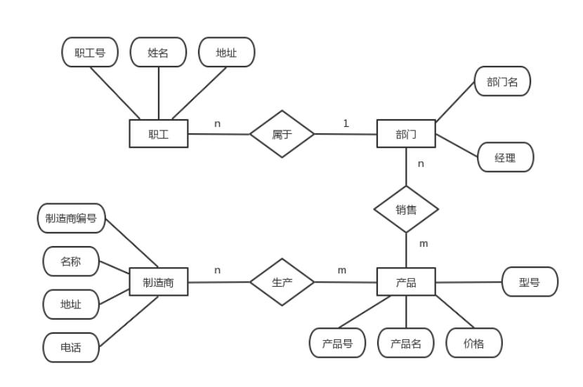
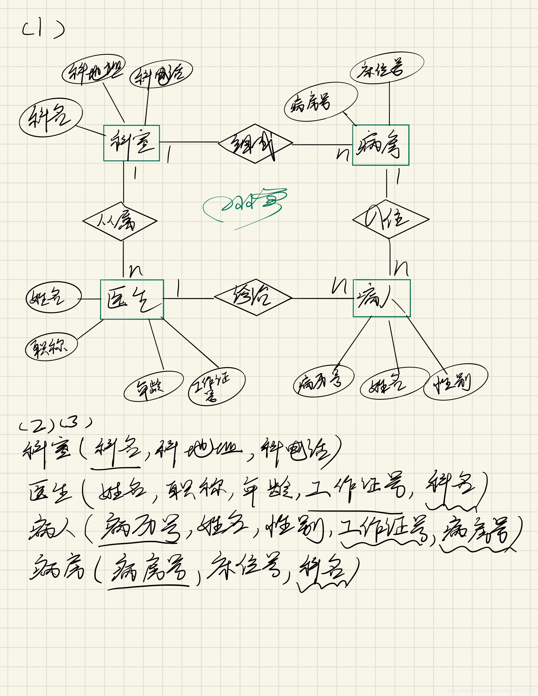
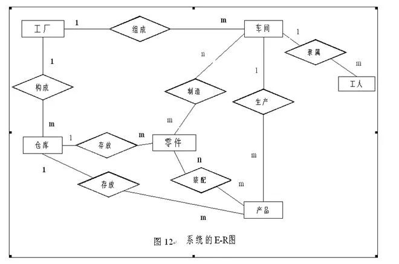

# 数据库原理与应用 课程习题

本份文件为2024-2025第一学期最后一个课时前发布的习题，要求在课前完成1、2、3题。  
原文件格式问题较大，故将其修正为了markdown文档，同时修改了部分排版和表达使题目可读性更佳。 [@Xuuyuan](https://www.github.com/Xuuyuan)
## 习题部分
### 一
假定一个部门的数据库包括以下信息：  
* 职工的信息：职工号、姓名、住址和所在部门
* 部门信息：部门所在的职工、经理和销售产品
* 产品的信息：产品名、制造商、价格、型号及产品内部编号
* 制造商的信息：制造商名称、地址、生产的产品名和价格

请完成如下习题：
1. 画出该数据库的E-R图。

### 二
某医院病房计算机管理中需要如下信息：
* 科室：科名、科地址、科电话、医生名
* 病房：病房号、床位号，所在科室名
* 医生：姓名、职称、年龄、工作证号
* 病人：病历号、姓名、性别、诊断、主管医生，病房号

其中，一个科室有多个病房、多个医生，一个病房只能属于一个科室，一个医生只属一一个科室，但可负责多个病人的诊治，一个病人的主管医生只有一个。  
请完成如下习题：
1. 设计E-R图。
2. 把E-R图转化为关系模型。
3. 指出每个关系模型的主码。

### 三
工厂需建立一个管理数据库，存储以下信息：
* 一个厂内有多个车间，每个车间有车间号、车间主任姓名、地址和电话
* 一个车间有多个工人，每个工人有职工号、姓名、年龄、性别和工种
* 一个车间生产多种零件，一个零件也可能为多个车间制造。
* 零件有零件号、重量和价格。
* 一个产品由多种零件组成，一种零件也可以装配出多种产品。
* 产品和零件均放入仓库。
* 厂内有多个仓库，仓库有仓库号、仓库主任姓名和电话。

请完成如下习题：
1. 画出该系统的E-R图。
2. 给出相应的关系数据模型。

### 四
设有如下关系表R：

| 职工号 | 职工名 | 年龄 | 性别 | 单位号 | 单位名 | 
| --- | --- | --- | --- | --- | --- | 
| E1 | ZHAO | 20 | F | D3 | CCC | 
| E2 | QIAN | 25 | M | D1 | AAA | 
| E3 | SEN | 38 | M | D3 | CCC | 
| E4 | LI | 25 | F | D3 | CCC | 

请完成如下习题：
1. R是否属于3NF范式？为什么？若不是，它属于第几范式？
2. 如何将R规范化为3NF范式？

### 五
有如下关系：
| SNO	| CNO	| CTITLE	| INAME | ILOCA | GRADE | 
| --- | --- | --- | --- | --- | --- | 
| 80152 | C1 | OS | 王平 | D1 | 70 | 
| 80153 | C2 | DB | 高升 | D2 | 85 | 
| 80154 | C1 | OS | 王平 | D1 | 86 | 
| 80154 | C3 | AI | 杨杨 | D3 | 72 | 
| 80155 | C4 | CL | 高升 | D2 | 92 | 

请完成如下习题：
1. 给出的关系为第几范式？
2. 是否存在插入、删除异常？若存在，则说明原因？将它分解为高一级范式，分解后关系能否解决操作异常问题？

## 答案部分
### 一
假定一个部门的数据库包括以下信息：  
* 职工的信息：职工号、姓名、住址和所在部门
* 部门信息：部门所在的职工、经理和销售产品
* 产品的信息：产品名、制造商、价格、型号及产品内部编号
* 制造商的信息：制造商名称、地址、生产的产品名和价格

请完成如下习题：
1. 画出该数据库的E-R图。

答案：
  
\* 来自CSDN，在细节上可能略有差别。[原文地址](https://blog.csdn.net/m0_68681879/article/details/129360782)

### 二
某医院病房计算机管理中需要如下信息：
* 科室：科名、科地址、科电话、医生名
* 病房：病房号、床位号，所在科室名
* 医生：姓名、职称、年龄、工作证号
* 病人：病历号、姓名、性别、诊断、主管医生，病房号

其中，一个科室有多个病房、多个医生，一个病房只能属于一个科室，一个医生只属一一个科室，但可负责多个病人的诊治，一个病人的主管医生只有一个。  
请完成如下习题：
1. 设计E-R图。
2. 把E-R图转化为关系模型。
3. 指出每个关系模型的主码。

答案：
 
\* 来自CSDN，在细节上可能略有差别。[原文地址](https://blog.csdn.net/weixin_46218781/article/details/106048551)

### 三
工厂需建立一个管理数据库，存储以下信息：
* 一个厂内有多个车间，每个车间有车间号、车间主任姓名、地址和电话
* 一个车间有多个工人，每个工人有职工号、姓名、年龄、性别和工种
* 一个车间生产多种零件，一个零件也可能为多个车间制造。
* 零件有零件号、重量和价格。
* 一个产品由多种零件组成，一种零件也可以装配出多种产品。
* 产品和零件均放入仓库。
* 厂内有多个仓库，仓库有仓库号、仓库主任姓名和电话。

请完成如下习题：
1. 画出该系统的E-R图。
2. 给出相应的关系数据模型。

答案：
1.   
2. 相应的关系模式如下：
  * 工厂（厂名、厂长姓名）
  * 车间（车间号、车间主任姓名、地址、电话、厂名）
  * 工人（职工号、姓名、年龄、性别、工种、车间号）
  * 仓库（仓库号、仓库主任姓名、电话、长名）
  * 产品（产品号、价格、车间号、仓库号）
  * 零件（零件号、重量、价格、仓库号）
  * 制造（车间号、零件号）

\* 来自墨天轮，在细节上可能略有差别。[原文地址](https://www.modb.pro/db/59490)
### 四
设有如下关系表R：

| 职工号 | 职工名 | 年龄 | 性别 | 单位号 | 单位名 | 
| --- | --- | --- | --- | --- | --- | 
| E1 | ZHAO | 20 | F | D3 | CCC | 
| E2 | QIAN | 25 | M | D1 | AAA | 
| E3 | SEN | 38 | M | D3 | CCC | 
| E4 | LI | 25 | F | D3 | CCC | 

请完成如下习题：
1. R是否属于3NF范式？为什么？若不是，它属于第几范式？
2. 如何将R规范化为3NF范式？

答案：
1. R不是3NF，它是2NF。  
原因：根据表格可知，R的候选码为职工号或者职工名，而职工号可推出单位号，但单位号不能推出职工号；单位号可以推出单位名，所以单位名传递依赖职工号，即非主属性单位名对候选码职工号的传递依赖。故是2NF范式。
2. 将R分解为R1、R2两个关系模式：  
R1(职工号，职工名，年龄，性别，单位号）  
R2(单位号，单位名）  
得到的R1、R2满足3NF范式。

### 五
有如下关系：
| SNO	| CNO	| CTITLE	| INAME | ILOCA | GRADE | 
| --- | --- | --- | --- | --- | --- | 
| 80152 | C1 | OS | 王平 | D1 | 70 | 
| 80153 | C2 | DB | 高升 | D2 | 85 | 
| 80154 | C1 | OS | 王平 | D1 | 86 | 
| 80154 | C3 | AI | 杨杨 | D3 | 72 | 
| 80155 | C4 | CL | 高升 | D2 | 92 | 

请完成如下习题：
1. 给出的关系为第几范式？
2. 是否存在插入、删除异常？若存在，则说明原因？将它分解为高一级范式，分解后关系能否解决操作异常问题？

答案：
1. 该表为第一范式(1NF)，因为存在插入异常和删除异常。当学生还没选修课程时，不能插入该生信息。当学生退学时，删除学生，会把课程信息和老师信息都删除。
2. 存在插入、删除异常。原因：该关系的主码是(SNO,CNO),主码的取值是不能为空，所以没选修课程时，CNO是空，故不能插入。  
该关系仅非主属性DRAD完全依赖主码(SNO,CNO)，其他非主属性CTITLE, INAME和ILOCA对主码都是部分依赖，故是1NF。
   - 分解模式后得到R1和R2关系：  
R1(SNO,CNO,GRADE)  
R2(CNO,CTITLE,INAME,ILOCA)  
分解后两个关系模式是2NF，并没有解决插入、删除异常。  
例如：对于R2表，若有一新老师报到而需将其有关数据进行插入，当取消某门课程而删除R2表中的一条记录时，会将不该删除的教师的信息也删除。原因是R2关系存在非主属性ILOCA对候选码CNO的传递依赖。  
   - 对R2关系进一步分解：  
R3(CNO,CTITLE,INAME)  
R4(INAME,ILOCA)  
   - 故最后能够得到：   
R1(SNO,CNO,GRADE)  
R3(CNO,CTITLE,INAME)  
R4(INAME,ILOCA)  
这三个关系满足3NF范式，基本解决操作异常。