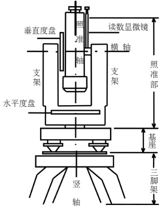
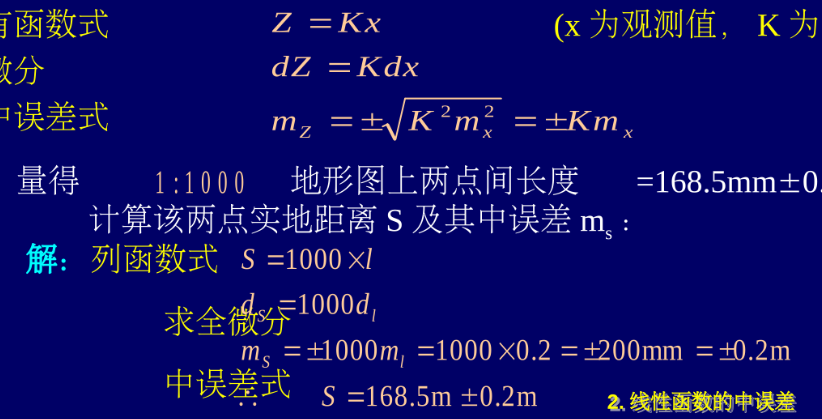

# 24-25学年普通测量学期末复习题纲

有一点复杂.. [@Xuuyuan](https://github.com/Xuuyuan)  
重点内容（划重点部分提及内容）以emoji⭐进行标记。

## 卷面分数构成

- 分数构成
  - 填空题：15分
  - 单项选择题：10题，每题2分，共20分
  - 名词解释：5小题，每题3分，共15分
  - 简答题：约20分
  - 计算题：约30分
- 期末考试需要携带计算器。
- 简答题：操作步骤、误差处理的内容等
- 计算题：平时课堂上的计算内容、内业数据处理涉及到的计算等

## 第一部分 课程介绍与测量学基础知识（教材第一章及第二章的第一节）

- ⭐ 了解主要概念。
- 测量学：测量学是研究如何测定地面点的平面位置和高程，将地球表面的地形及其他信息测绘成图，以及确定地球的形状和大小等的学科。
- 测图：根据控制网将地面上的地物和地貌按规定的比例尺测绘到图纸上，供规划设计使用。
- 用图：利用地形图解决工程上若干基本问题。
- ⭐ 放样：根据控制网将图纸上已设计好的建筑物的平面位置和高程按设计要求测设到地面上，作为施工的依据。
- 水准面&大地水准面&大地体：设想有一个静止的水面，向陆地延伸而形成一个封闭的曲面，这个静止的水面称为水准面。水准面有无数个，其中通过平均海水面的一个称为大地水准面，所包围的形体称为大地体。水准面处处与铅垂线相垂直。
- 铅垂线：即重力方向线，是测量工作的基准线。
- 旋转椭球面：非常接近大地体的几何形体，作为测量计算和制图的基准面。
- 椭球定位：确定椭球体与大地体的相关位置，使椭球体与大地体密合最好。
- 地面点位的确定和表示方法
  - 投影面位置(x,y)：地面点**沿投影线**在**投影面**上的坐标系中的坐标分量。
  - 高程(h)：地面点**沿投影线**到**投影面**的距离。
- 测量常用坐标系及其之间的转换
  - 大地坐标系（基准线：法线、基准面：椭球面、表示方法：大地经度L,大地纬度B,大地高H）
  - 天文坐标系（基准线：垂线、基准面：大地水准面、表示方法：天文精度λ,天文纬度φ,海拔高H正）
  - 平面坐标系（椭球定位时，椭球中心在地球质心的坐标系）
  - 空间直角坐标系（坐标原点：地球椭球体中心、Z轴：指向北极、X轴：指向格林尼治方向、Y轴：垂直于XOZ平面）
  - 转换公式过于复杂，此处不表
- 中国常用坐标系
  - 1954北京坐标系（参考椭球：克拉索夫斯基椭球、大地原点：前苏联境内）
  - 1980国家大地坐标系（参考椭球：IUGG-75、大地原点：陕西省泾阳县）
  - WGS-84坐标系（参考椭球：WGS-84椭球、坐标原点：地球质心）
- 高程基准面：通过长期观测取海水的平均高度作为高程零点，以通过该点的大地水准面作为高程基准面。
- 我国使用的高程：1956黄海高程、1985国家高程
- 用水平面代替水准面的限度
  - 半径10km，面积320km²之内，距离误差可忽略不计
  - 普通测量工作可忽略角度误差
  - 即使距离很短，也需要顾及地球曲率对高程测量的影响
- 测量工作概述
  - 原则：由整体到局部，先控制后碎部，步步检核
  - 基本工作：测角、量边、测高程
- ⭐高斯投影的概念（自行总结）
  - 投影后的角度保持不变，图上的图形与实地的图形相似的，将地球表面的经纬度坐标转换为平面直角坐标，从而实现地图的绘制的横轴圆柱投影。
- ⭐投影带的判断
  - 6°带：带号N=[经度L/6]+1，中括号代表向下取整
  - 3°带：带号N=[(精度L-1.5)/3]+1，中括号代表向下取整

## 第二部分 水准测量/高程测量（教材第三章第1-5节）

- ⭐高程、高差、绝对高程、相对高程的概念
  - 高程：地面点到某一基准面的垂直距离。
  - 高差：两个地面点之间的高程差。
  - 绝对高程：地面点到大地水准面的垂直距离。
  - 相对高程：地面点到某一特定基准面的垂直距离。
- 高程测量
  - 概念：测量地面上各点的高程的工作。
  - 分类
    - 水准测量
    - 三角高程测量
    - 物理高程测量
    - GPS高程测量
- ⭐水准测量的原理：借助水准仪提供的一条水平视线和带刻划的标尺，测定地面上的两点（如A、B点）的高差（hAB），再根据已知高程（hA）求得待求点高程（hB）。
- 高差：高差hAB为后视尺的读数a减去前视尺的读数b，即hAB=a-b。
- 水准仪及其使用
  - 水准仪的分类
    - 按精度分：DS05、DS1、DS3、DS10
    - 按构造分：微倾水准仪、自动安平水准仪、数字水准仪
  - 掌握水准仪的构造  
    
  - 微倾水准仪的主要轴线及其关系：CC//LL；VV//L’L’；十字丝横丝垂直与仪器竖轴
  - 水准尺、尺垫
    - 水准尺的分类：分为直尺、折尺和塔尺（或分为单面尺和双面尺）
    - 尺垫：用来竖立水准尺和标志转点，起高程传递作用。
  - 水准仪的使用步骤：安置和初略整平→瞄准→精平→读数。
  - 初略整平的方法：遵循先两个后一个的原则，气泡移动的方向与左手大拇指的切线方向一致。
  - 注意事项：每次读数前消除视差、要使管水准气泡居中；尽量保持前后视距相等；水准尺保持铅直。
- 水准点：事先埋在地面上，用水准测量方法建立的高程控制点。
- 转点：临时的立尺点，作为传递高程的过渡点。
- 有测站检核的测量法：双面尺法（红面尺算得的高差±0.100m）；变仪器高法
- 水准路线的布置形式：闭合水准路线；附和水准路线；支水准路线
- ⭐水准测量的施测步骤（自行整理）
  - 仪器准备、设置水准仪、读取水准尺读数、计算高差、计算待测点高程、记录和校核
- ⭐获取的数据处理
  - 等外水准测量的高差闭合差容许值：±12√n mm，±40√L mm
  - 闭合水准路线的内业计算步骤：高差闭合差的计算、高差闭合差的调整、待求点高程的计算
  - 附和水准测量的内业计算步骤：高差闭合差的计算、高差闭合差的调整、待求点高程的计算
- ⭐水准测量的误差来源及其分类
  - 仪器误差
    - 残余误差：水准管轴与视准轴不平行
    - 水准尺误差：刻划不准确、尺长变化与弯曲、零点差
  - 观测误差
    - 读数误差
    - 视差影响
    - 水准管气泡居中影响
    - 水准尺倾斜误差
  - 外界条件的影响
    - 仪器、尺垫下沉
    - 地球曲率和大气折光的影响
    - 温度影响

## 第三部分 角度测量（教材第四章第1-4、6节）

- 角度测量
  - 角度测量的目的
    - 水平角测量：求算地面点的平面位置
    - 竖直角测量：测定地面两点的高差，或将斜距转化为平距
  - 角度测量的原理
    - ⭐水平角的定义：地面上两相交直线之间的夹角在**水平面**上的投影，称为水平角。
    - 水平角测量原理：  
        
    - 测量水平角经纬仪应具备的条件
      - 有一个能置于水平位置带刻线的圆盘
      - 圆盘中心必须处于角顶点的铅垂线上
      - 望远镜不仅能在水平方向，而且可以在竖直方向转动以瞄准不同方向不同高度的目标
    - ⭐竖直角的定义：同一竖直平面内倾斜视线与水平线间的夹角。
    - 竖直角测量原理：  
        
    - 测量竖直角经纬仪应具备的条件
      - 有一个能置于竖直位置带刻线的圆盘
      - 圆盘中心必须处于横轴上，且随同横轴一起转动
      - 望远镜不仅能在水平方向，而且可以在竖直方向转动以瞄准不同方向不同高度的目标
      - 具有一个读数设备
- 经纬仪及其使用
  - 经纬仪的构造  
    
  - 经纬仪的分类
    - 按构造原理及读数系统：光学经纬仪、电子经纬仪
    - 按精度高低：DJ07、DJ1、DJ2、DJ6、DJ15、DJ60等
  - 经纬仪的主要轴线  
    
  - 经纬仪的基本操作（初略安置→对中→整平→照准→读数）
    - 对中
      - 目的：仪器水平度盘中心与测站点中心位于同一铅垂线上
      - 方法：垂球对中、光学对中器对中
    - 整平
      - 目的：使得水平度盘处于水平位置
      - 方法：先两个，后一个，左手大拇指运动方向一致
      - 圆水准器用于概略整平，管水准器用于精确整平
    - 照准
      - 方法：松开照准部和望远镜的制动钮，调节目镜使得十字丝清晰，转动望远镜照准目标、用望远镜的（微制动、制动、水平微制动、水平制动）螺旋精确照准
    - 读数
      - 方法：调节反光镜，使得读数窗清晰；调节读数显微镜的调焦螺旋使得读数清晰；认清刻划线的形式和读数方法
      - 注意度、分直接读出，秒值使用估读
- ⭐水平角测量的方法
  - 测回法：一个测站观测2个方向时用  
    
    - 测回法观测手簿中，上半测回和下半测回的角值差应当在40″内
  - 方向观测法：一个测站观测3个或3个以上方向时用，也称为全圆测回法  
    
- ⭐竖直角测量的方法
  - 竖直角的定义：在同一铅垂面内，瞄准目标的倾斜视线与水平视线的夹角。取值范围为[-90°,90°]，仰角为正，俯角为负。
  - 竖直角的观测步骤
    - 在测站上安置仪器（对中、整平）
    - 确定竖直角的计算公式
    - 用盘左观测上半测回竖直角：调节竖盘指标水准管调节螺旋，使竖盘指标水准管气泡集中，读起盘左读数，记入手簿
    - 用盘右观测下半测回竖直角：在盘右位置调节竖盘指标水准管调节螺旋，使竖盘指标水准管气泡集中，读起盘右读数，计入手簿
    - 计算竖直角
      - 盘左αL=90°-L
      - 盘右αR=R-270°
      - 一测回角值=(αL+αR)/2
  - 竖盘指标差
    - 定义：竖盘指标不恰好指在90°或270°的位置，而与正确位置相差的小角度x。
    - 计算：x=(αR-αL)/2=(R+L-360°)/2
  - 竖盘指标的自动补偿：在竖盘光路中安装一个补偿器，当仪器竖轴偏离铅垂线的角度在一定范围内时，通过补偿器仍能读到相当于竖盘指标管水准气泡居中时的竖盘读数。
- 经纬仪的检验与校正
  - 经纬仪的主要轴线及其相互关系  
    
  - 经纬仪的检验与其校正方法
    - 照准部水准管的检验与校正
      - 不良影响：VV轴无法铅垂，影响空间角投影为水平角和竖直角、H轴随方向而变
      - 检验：气泡居中后旋转180°是否仍然居中
      - 校正：用水准管校正螺旋使气泡返回一半，用脚螺旋纠正一半
    - 十字丝的校验与校正
            = 不良影响：不能精确瞄准目标
      - 检验：用十字丝交点精确照准远处一清晰目标点A。旋紧水平制动螺旋与望远镜制动螺旋，慢慢转动望远镜制动螺旋，如点A离开竖丝，则需要校正
      - 校正：旋下目镜分划板护盖，松开4个压环螺丝，慢慢转动十字丝分划板座，然后再作检验。待条件满足后再拧紧压环螺丝，旋上护盖。
    - 视准轴的检验与校正
      - 不良影响：在绕横轴旋转时视准轴画出圆锥面，观测同一铅垂面内不同高度的目标时，将有不同的水平度盘读数，从而产生测角误差
      - 检验
        - 盘左，先照准A点，倒转望远镜得B1
        - 盘右，先照准A点，倒转望远镜得B2
        - 若B1、B2不重合，则有此误差
      - 校正：在B2附近标出扣除c影响后的B点，平移十字丝使视准轴照准B点
    - 横轴的检验与校正
      - 不良影响：视准轴画出倾斜面，观测同一竖直面内不同高度的目标时，将有不同的水平度盘读数，从而产生测角误差
      - 检验
        - 盘左，先照准高点P，再投影至仪器高度得A点
        - 盘右，先照准同一点P，再投影至仪器高度得B点
        - 若AB不重合，则有此误差
      - 校正
        - 标明AB的中点M
        - 照准M点，抬高望远镜至P附近
        - 升降横轴的一端使照准P点
    - 竖盘指标差的校验与校正
      - 检验：安置仪器，用盘左、盘右两个镜位观测同一目标点，分别使竖盘指标水准管气泡居中，读取竖盘读数L和R，计算指标差X。如X超出±1′的范围，则需要改正
      - 校正：盘右照准目标点，不含指标差的盘右读数应为R-X。转动竖直度盘指标水准管微动螺旋，使得竖盘读数为R-X，再用拨针拨动指标水准管校正螺旋，使得气泡居中。
- 角度测量的误差
  - 仪器误差：视准轴误差、横轴误差、竖轴误差、竖盘指标差、度盘偏心差、度盘刻划不均匀误差
  - 观测误差：对中误差、目标偏心误差、照准误差、读数指标差
  - 外界条件影响引起的误差：影响仪器的稳定、影响水准管气泡的居中

## 第四部分 距离测量（教材第五章第1-8小节、第二章第3小节、课堂补充资料）

- 距离测量概述
  - ⭐距离测量的定义：测量地面两点间的水平距离。
  - ⭐距离测量的常用方法：钢尺直接量距、视距法测距、电磁波测距、卫星测距
  - 定线的目的：测量的距离较长，需要分段进行测量。为了使所量出来的线段在一条直线上，需要在待测直线上标定出每一尺段的首尾位置。
- 钢尺量距
  - 了解量距工具（钢卷尺及皮尺，还有花杆、测钎等辅助工具）
  - 钢尺检定的方法：尺长方程式、直接比尺法、基线检定法
  - ⭐量距方法
    - 整尺法量距在平坦地面上丈量水平距离
    - 水平量距法（平量法）
    - 倾斜量距法（斜量法）
  - 精密量距的步骤：定线打桩、测定桩顶间高差、量距、成果整理
  - ⭐⭐精密量距的数据处理（成果整理的三项改正数）：尺长改正、温度改正、倾斜改正  
    
  - 钢尺量距的误差：定线误差、尺长误差、温度误差、拉力误差、钢尺倾斜误差、钢尺对准及倾斜误差
- 视距测量
  - 视距测量的定义：利用望远镜内十字丝分划板上的视距丝及刻有厘米分划的视距尺同时测定测站点至观测点之间的水平距离与高差的一种方法。
  - 视线水平及倾斜时的视距测量原理：公式太复杂，略
  - 视距测量方法
    - 将经纬仪安置在测站A，进行对中和整平
    - 量取仪器高i
    - 将视距尺立于欲测的B点上，分别读出上、下视距丝和中丝读数（N,M,l），将上丝读数减去下丝读数得到视距间距n=N-M
    - 在中丝不变的情况下读取竖直盘读数，并将竖盘读数换算为竖直角α
    - 根据测得的n,α,l和i计算水平距离D和高差h，再根据测站的高程计算出测点
  - 视距测量误差的来源
    - 视距尺分划误差
    - 乘常数K值的误差
    - 竖直角测量的误差
    - 视距丝读数的误差
    - 视距尺倾斜的影响
    - 外界气象条件的影响
- 电磁波测距
  - 测距仪的发展历史：单测距仪 > 组合式测距仪 > 一体化全站仪
  - 测距仪的分类
    - 按载波（光源）：微波测距仪、激光测距仪、红外测距仪
    - 按测程：短程测距仪（小于5km）、中程测距仪、远程测距仪（大于15km）
    - 按精度：I级测距仪（mD<=5mm）、II级测距仪、III级测距仪（mD>=10mm）
  - 电磁波测距仪的测距原理：略
- 全站仪
  - 全站仪的定义：全站仪是由电子测角、光电测距、微型机及其软件组合而成的智能型光电测量仪器。
  - 全站仪的基本功能：测量水平角β、竖直角V和斜距。
  - 全站仪的功能：三维坐标测量、悬高测量、对边测量、放样、后方交会、偏心测量与面积测量（具体原理略）
  - 全站仪的认识与使用：安置仪器；开机；设置仪器参数；测角、测距、测坐标测量；数据的导入与导出

## 第五部分 测量误差及数据处理基础知识（教材第六章）

- ⭐测量误差的基本概念
  - 测量误差：对某一个物理量或几何量观测时产生的差异。测量误差=观测值-真值
  - 真值：任何一个观测量，客观上总是存在着的一个能代表其真正大小的数值。
  - 观测与观测值的分类
    - 同精度观测值与不同精度观测值
    - 直接观测值与间接观测值
    - 独立观测量与非独立观测量
  - 掌握测量误差的定义及其来源
  - 测量误差的种类
    - 粗差：也称错误，是由于观测者的疏忽或操作仪器不正确引起的，应该被避免。
    - 系统误差：在相同观测条件下作一系列观测，若误差的大小及符号表现出系统性，则称其为系统误差。
    - 偶然误差：在相同观测条件下作一系列观测，若误差的大小及符号表现出偶然性（从总体看有一定的统计规律），则称其为偶然误差。
- 测量精度
  - ⭐精度：对某一个量的多次观测中，各观测值之间的离散程度。
  - 定义精度的参数：精密度（偶然误差大小的程度）、正确度（系统误差大小的程度）、准确度（测量结果与真值的一致程度）
- 误差传播定律
  - 定义：阐述观测值函数中误差与观测值中误差关系的定律称为误差传播定律。
  - ⭐误差传播定律的应用
    - 倍数函数的中误差  
        
    - 线性函数的中误差  
        
    - 算术平均值的中误差式  
        
    - 和或差函数的中误差  
        
- 直接平差与最小二乘原理
  - 直接平差法：对同一个值多次直接观测的结果，根据最小二乘法原理，求得其最或然值，称为直接平差法。又分为等精度直接平差与非等精度直接平差。
- 计算中的凑整规则：四舍六入，奇进偶舍（五时）

## 第六部分 控制测量（教材第七章）

- 控制测量概述
  - ⭐控制测量：用比较精密的仪器和严格的测量方法测定点的平面位置和高程。
  - ⭐控制网：在测区内选定若干个控制点而构成的几何图形称为测量控制网。
  - 平面控制测量：测定控制点平面位置(x,y)的工作。
  - 高程控制测量：测定控制点高程(h)的工作。
  - 测量工作的原则：从整体到局部，先控制后碎部
  - 平面控制网的建立方法：GPS、三角测量、三边测量、边角测量、导线测量
  - 高程控制网的建立方法：水准测量、三角高程测量、GPS高程测量
  - 国家基本控制网：在全国范围内建立的控制网，提供全国性的、统一的空间定位基准。
  - 城市控制网：在城市地区建立的控制网，为城市建设提供基本控制点。
  - 工程控制网：为满足工程建设的需要而在工程所涉及的区域内布设的测量控制网。
  - 图根控制网：为满足测图需要，在测区范围内建立的控制网。
- 导线测量
  - 导线：由测区内选定的相邻控制点连成直线而构成的连续折线。（相关概念：导线点、导线边、转折角、左角、右角、起算数据）
  - 附合导线：布设在两已知点间的导线。
  - 闭合导线：起始和结束在同一已知点的导线。
  - 支导线：既不附合到另一已知点，又不回到原起始点的导线。
  - 导线测量的外业工作：初拟方案、踏勘、选点、造标；边长测量；角度测量；连接测量
  - ⭐⭐（重点！）导线测量的内业计算（数据处理）
    - 闭合导线的计算
      - 角度闭合差的计算与调整
      - 坐标方位角的计算
      - 坐标增量闭合差的计算与调整
      - 坐标的计算
    - 附合导线的计算
      - 角度闭合差的计算与调整
      - 坐标方位角的计算
      - 坐标增量闭合差的计算与调整
      - 坐标的计算
    - 支导线的计算
      - 依次推算各边的坐标方位角
      - 依次推算各边的坐标增量
      - 依次推算各点的坐标
- 控制点加密：当原有控制点的密度不能满足工程施工或大比例尺测图要求时，需要在施工区或测区增加一些控制点，称为控制点加密。
- 控制点加密方法：交会定点（前方交会、后方交会）、极坐标法
- 三等、四等水淮测量
  - 外业实施过程
    - 每一站的观测顺序（后-前-前-后）
    - 测站计算与检核
  - 内业数据处理方法：略
- 球差、气差：当两点间的距离大于300m时，要考虑地球曲率及大气垂直折光的影响。前者为地球曲率差，简称球差；后者为大气垂直折光差，简称气差。

## 第七部分 大比例尺地形图测绘与应用（教材第九章、第二章第2、5-7小节）

- 地图的相关知识
  - 地图：地图是由**数学**所确定的经过**综合概括**并用形象符号表示的**地球表面在平面上的图形**。
  - 地图包含的内容
    - 数学要素：映射函数……坐标系统、高程系统、地图投影、分幅、比例尺
    - 几何要素：地形要素……地物、地貌
    - 地图综合：对地形要素及社会现象的合理取舍和综合概括
  - 地图的分类
    - 按不同内容（用途）分：一般地图、专题地图
    - 按不同存储介质分：纸质地图、数字地图、电子地图
- 地形图的基本知识
  - 地形图：按照一定比例尺，用规定的符号和方法，表示地物的平面位置和高程的正射投影图。
  - 地形图的比例尺：地形图上任意一线段的长度与地面上相应线段的实际水平长度之比。
  - 地形图的比例尺种类：数字比例尺、图示比例尺
  - 地形图的比例尺分类：大比例尺地形图、中比例尺地形图、小比例尺地形图
  - 地形图的精度：图上0.1mm所表示的实地水平长度
  - 选用比例尺的原则
    - 地物和地貌的详尽程度和明晰程度能否满足要求
    - 平面点位和高程精度
    - 图幅的大小应便于总图设计布局的需要
    - 在满足上述要求的情况下，尽可能选用较小比例尺测图
  - 地物符号的类型：比例符号、半比例符号（线形符号）、非比例符号、地物注记
  - 等高线：是地面上高程相同的相邻点所连接而成的连续闭合曲线
  - 等高距&等高线平距：相邻等高线之间的高差称为等高距，相邻等高线之间的水平距离称为等高线平距
  - 等高线的分类：首曲线、计曲线、间曲线、助曲线
- ⭐大比例尺地形图传统测绘方法
  - 测图前的准备工作：图纸准备、绘制坐标格网、展绘控制点
  - 碎部测量的方法：碎部点的选择、测定碎部点平面位置的方法、经纬仪测绘法与典型地物的测量
  - 地形图的绘制方法：地物描绘、等高线勾绘、地形图的拼接检查与清绘
- 大比例尺地形图数字测图方法
  - ⭐数字测图：通过全站仪、GPS等仪器采集地形点的三维坐标、连接信息与属性信息，通过计算机软件进行数据处理，人工交互方式编辑地图。测量成果为数字地图，通过计算机显示、输出。
  - ⭐数字测图的方法
    - 草图法：野外测记、室内成图，记录点号，画草图
    - 简码法：电子手簿记录点位及连码文件
    - 电子平板法：观测数据实时传输到成图软件，所见即所得
  - ⭐数字测图的作业流程
    - 图根控制测量：踏勘选点、外业观测、成果计算
    - 碎部测量：测站设置、定向与检核、碎部点坐标测量
    - 内业编图
    - 地形图输出
- ⭐（了解）地形图的应用
  - 掌握地形图的识读方法(图外注记识读、地物识读、地貌识读)
  - 地形图应用的基本内容
    - 求图上某点的坐标和高程：确定点的坐标、确定点的高程
    - 确定图上直线的长度、坐标方位角及坡度
      - 确定图上直线的长度（直接量测或根据两点坐标计算水平距离）
      - 求某直线的坐标方位角（图解法或解析法）
      - 确定图上直线的坡度（是其两端点的高差与水平距离的比值）
    - 图形面积的量算（透明方格纸法、平行线法、解析法、求积仪法）
- ⭐（了解）（AI总结）不动产权：不动产权指与土地及其附着物相关的权利和权益，包括土地权属、建筑物权属、权籍调查、法律效力。

### 参考资料

（有前后顺序优先级之分）

- 24-25 学年测量学期末划重点
- 普通测量学课程学习指南
- 学习通《普通测量学》教材PPT
- 《测量学教程》第四版, 测绘出版社
