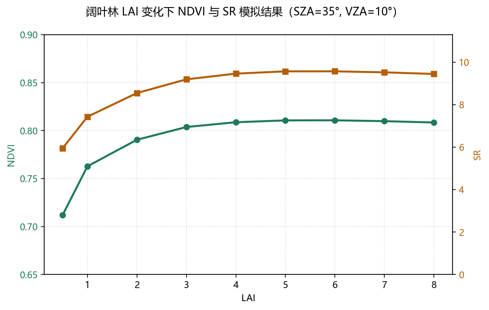
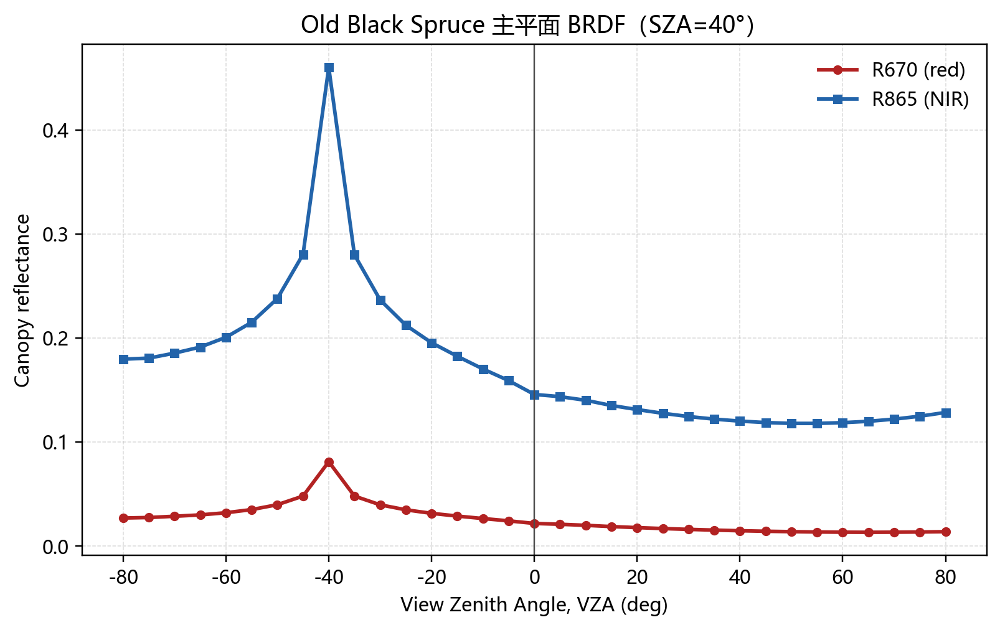
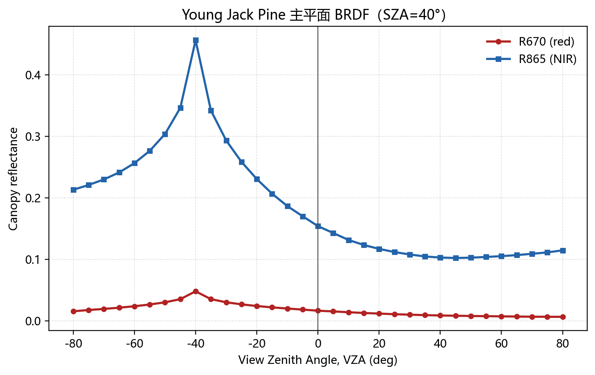
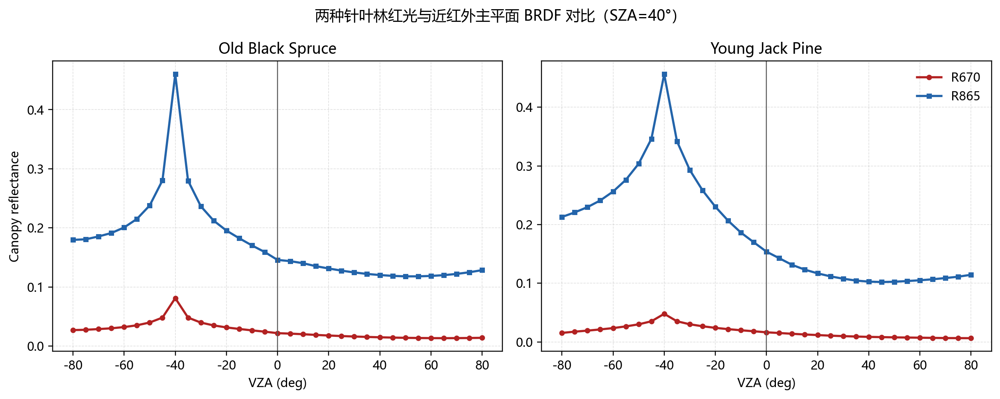

# 作业二：基于 5-SCALE 的冠层反射光谱和 BRDF 模拟材料

## 一、模拟设置

本次模拟使用 5-SCALE 1.5.1 可执行程序完成。红波段采用程序 Band 1，即 670 nm；近红外波段采用 Band 2，即 865 nm。

1. LAI 敏感性模拟：森林类型选用 `Old Aspen`，作为阔叶林情景；太阳天顶角 SZA = 35°；观测天顶角 VZA = 10°；提取主平面输出中 VZA = 10°、PHI = 180° 的结果。植被指数计算式为：

   NDVI = (R865 - R670) / (R865 + R670)

   SR = R865 / R670

2. BRDF 模拟：选取两种针叶林 `Old Black Spruce` 和 `Young Jack Pine`；太阳天顶角 SZA = 40°；采用 5-SCALE Plane Mode 主平面输出，观测天顶角范围约为 -80° 至 80°，步长 5°。图中负、正 VZA 分别表示主平面两个相对观测方向。

> 注：5-SCALE 的 Hemispherical Mode 在本机批量导出时不稳定，因此本材料采用 Plane Mode 主平面 BRDF 二维曲线。该模式仍直接反映红光和近红外反射率随观测方向变化的 BRDF 特征。

## 二、阔叶林 LAI 变化下 NDVI 和 SR

|   LAI |   R670 |   R865 |   NDVI |     SR |
|------:|-------:|-------:|-------:|-------:|
|   0.5 | 0.0312 | 0.1856 | 0.7121 | 5.9469 |
|   1   | 0.0275 | 0.2043 | 0.7628 | 7.4302 |
|   2   | 0.0232 | 0.1984 | 0.7905 | 8.5454 |
|   3   | 0.0214 | 0.1963 | 0.8038 | 9.1921 |
|   4   | 0.0206 | 0.1946 | 0.8088 | 9.4606 |
|   5   | 0.0203 | 0.1943 | 0.8107 | 9.5678 |
|   6   | 0.0203 | 0.1944 | 0.8108 | 9.5691 |
|   7   | 0.0205 | 0.1952 | 0.8099 | 9.5214 |
|   8   | 0.0208 | 0.1962 | 0.8085 | 9.4453 |

### 结果描述

随着 LAI 从 0.5 增加到 8.0，红波段 R670 整体降低，近红外 R865 整体升高，说明冠层加密后红光吸收增强、近红外多次散射增强。NDVI 从 0.7121 增加到 0.8085，总体呈上升趋势，但在 LAI 较高时增幅变小，表现出一定饱和现象。SR 从 5.9469 增加到 9.4453，变化幅度比 NDVI 更大，对高 LAI 的响应更明显。模拟中 NDVI 最大值出现在 LAI = 6.0，SR 最大值出现在 LAI = 6.0。

## 三、两种针叶林红波段和近红外 BRDF 特征

### 1. Old Black Spruce

### 2. Young Jack Pine

### 3. 对比图

| 森林类型         | 波段   |   最小反射率 |   最小值VZA(°) |   最大反射率 |   最大值VZA(°) |
|:-----------------|:-------|-------------:|---------------:|-------------:|---------------:|
| Old Black Spruce | R670   |       0.0134 |             65 |       0.0812 |            -40 |
| Old Black Spruce | R865   |       0.118  |             50 |       0.4599 |            -40 |
| Young Jack Pine  | R670   |       0.0063 |             80 |       0.0478 |            -40 |
| Young Jack Pine  | R865   |       0.102  |             45 |       0.4562 |            -40 |

### 结果描述

两种针叶林在红波段和近红外波段都表现出明显的方向性反射特征。近红外 R865 的反射率显著高于红波段 R670，这是由于针叶冠层在近红外波段散射较强，而红光波段受叶绿素吸收影响较大。

Old Black Spruce 在太阳主平面附近出现较明显的反射峰，R670 和 R865 都在接近热点方向时升高，说明该方向阴影比例较低、可见受光冠层组分较多。远离热点方向后，红光和近红外反射率下降，近红外仍保持较高水平。

Young Jack Pine 的红光反射率整体低于 Old Black Spruce，而近红外方向变化幅度较大；在正向大观测角方向，R865 逐渐升高，NDVI/SR 也随之增大。这说明不同针叶林结构、冠层密度和枝叶聚集特征会改变阴影比例和多次散射路径，从而形成不同的 BRDF 曲线形态。

## 四、文件说明

- `lai_ndvi_sr.png`：阔叶林 LAI-NDVI/SR 折线图。
- `brdf_old_black_spruce.png`：Old Black Spruce 红光与近红外 BRDF 二维图。
- `brdf_young_jack_pine.png`：Young Jack Pine 红光与近红外 BRDF 二维图。
- `brdf_conifer_comparison.png`：两种针叶林 BRDF 对比图。
- `raw_lai_*.prn`、`raw_brdf_*_plane.prn`：5-SCALE 原始导出文件。
- `lai_ndvi_sr_table.csv`、`brdf_summary_table.csv`：由原始输出整理得到的辅助数据表。
