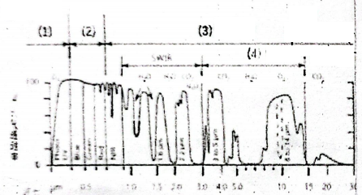
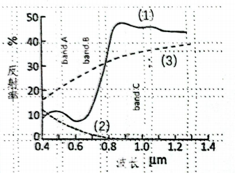

# 《遥感数字图像处理》2022-2023 学年第一学期考试A卷

## 福建师范大学地理科学学院

**专业**：地理信息系统  **年级**：2020级
**课程名称**：遥感数字图像处理  **任课教师**：李新通
**试卷类别**：闭卷  **考试用时**：120分钟
**考试时间**：2022年12月27日下午 08:00

-----

#### 一、判断题（对的标√，错的标×，每小题1分，共25分）

1. （ ） Landsat8第10、第11两个波段是热红外遥感波段，其光谱特性是反射光谱。
2. （ ） RGB彩色空间是由红、绿、蓝三原色构成的，而ISH空间是由颜色的类别、纯度和明亮程度构成。
3. （ ） 无线电波、红外线、可见光、紫外都是电磁波，其中近红外波段的波长介于0.76微米至6.0微米之间。
4. （ ） 人眼通过直接感觉出红、绿、蓝三色的比例来区分影像中的地物类型，如在真彩色图像中水体的颜色为蓝色。
5. （ ） 按波长或频率次序排列的电磁波序列称为光谱，带有发射光谱的卫星传感器在白天和夜间均可成像。
6. （ ） 在计算机中图像像素(Pixel)，它由Picture和Element两个词合并构词的。
7. （ ） 遥感数字图像在计算机中各像素的灰度值用整数表示。一幅 M×N 的数字图像，其像素灰度值可以用M行、N列的矩阵表示。
8. （ ） 一幅遥感影像中与星下点位置对应的地面分辨率高，离开星下点越远的位置，其影像变形也越大。
9. （ ） MODIS称为中分辨率成像光谱仪，其图像的地面分辨率低于250米。
10. （ ） SPOT卫星是由美国发射的地球观测卫星，NOAA卫星是法国国家海洋大气局的第三代实用气象观测卫星。
11. （ ） 光学卫星遥感常用的波段选择在1.8微米至10微米大气窗口之内。
12. （ ） 地球资源卫星如Landsat、Spot上的传感器不同时提供水汽和气溶胶数据，所以较难精确地大气校正。
13. （ ） 遥感图像中每个像元的亮度值代表的是该像元中地物的平均辐射值，是经过量化的辐射值，是一种相对的量度。
14. （ ） 国产卫星高分一号有5个16米分辨率的多光谱影像和1个8米分辨率的全色影像。
15. （ ） 一般地说，可见光波段反映的是地物的颜色和亮度的差异。近红外波段反映地面的辐射温度差异。
16. （ ） 清澈水体的光谱曲线表现为在可见光波段反射率低，在近红外或短波红外波段反射率高。
17. （ ） 在Landsat8遥感数据中，厦门机场位于119/043影像轨道上。
18. （ ） 按照处理级别，未经任何校正陆地卫星原始图像称为1级遥感数据产品。NDVI图像属于2级遥感数据产品。
19. （ ） 为改善遥感图像的视觉效果，对遥感图像的灰度赋予不同的色彩的结果称为伪彩色。
20. （ ） 图像镶嵌俗称拼接，是将多幅有重叠区域的影像或图表拼接在一起的过程，拼接后影像的数据大小是拼接前所有影像数据大小之和。
21. （ ） 遥感卫星传感器能分辨的空间、光谱以及时间细节的能力越强，其分辨率越高。
22. （ ） 健康植被的光谱曲线在可见光与近红外之间，具有随着波长的增加，反射率急剧增高的现象。
23. （ ） 以许多非常宽且光谱连续的波段进行遥感成像而获得数据称为高光谱数据。
24. （ ） 目前Sentinel-2有A、B两颗卫星，分别提供10米、20米和60米三种多光谱数据，其时间分辨率为10天。
25. （ ） 水体指数有多种类型，但多数是经数学方法处理的近红外波段与绿波段的比值特征统计。

-----

#### 二、填空题（每空1分，共25分）

1. 如下图，横坐标为波长，纵坐标为大气透过率，请填写(1)至(4)相应的波段名称。

      * (1) `__________`
      * (2) `__________`
      * (3) `__________`
      * (4) `__________`

    
    *(图示：大气透过率曲线图)*

2. Sentinel-2多光谱图像有 `____` 个红边波段；SPOT4图像多光谱地面分辨率为 `____` 米，全色波段的分辨率为 `____` 米；国产高分2号多光谱影像的地面分辨率为 `____` 米。

3. ETM图像中波长范围0.45-0.52微米，称 `____` 波段。波长范围0.63-0.69微米，称 `____` 波段，为叶绿素的主要吸收波段。波长2.08-2.36微米，称 `____` 波段。

4. 如上图，PCI存放影像数据的Bitmaps，中文名称是 `__________` 。非影像数据存放在 SEGMENT 中。
      * Georeferencing 称为 `__________`；
      * Vectors/Polygons 称为 `__________`；
      * Signatures 称为 `__________`；
      * Look-up Tables 称为 `__________`；
      * Pseudo-color Tables 称为 `__________`。

    
    *(图示：ERDAS软件界面截图)*

5. 如下图，根据下列三种地物光谱曲线，试判别某传感器中的三个波段名称，三种地物的名称。分别是：

      * Band A: `__________`
      * Band B: `__________`
      * Band C: `__________`
      * 地物名称 (1): `__________`
      * 地物名称 (2): `__________`
      * 地物名称 (3): `__________`

    
    *(图示：反射率与波长关系图，包含 Band A, B, C 区间及三条地物曲线)*

-----

#### 三、举例说明下列概念间的区别（每小题5分，共20分）

1. 亮度、灰度
2. 反射率、反照率
3. 波段、通道
4. 位深度、对比度

-----

#### 四、问答（共30分）

1. 影像几何校正中，什么是控制点？什么是误差？重采样的含义是什么？图示说明有哪些重采样方法？（共10分）

2. 阅读以下元数据文件，说明该影像的：(1)传感器名称、(2)成像时间、(3)地点、(4)波段数、(5)位深度、(6)投影、(7)椭球体、(8)基准面、(9)太阳方位角、(10)像元空间分辨率。（共10分）

    ```text
    <!-- 备注：此处尽量保持了原卷的缩进格式（虽然我认为不合理） -->
        GROUP = LANDSAT_METADATA_FILE
    GROUP = PRODUCT_CONTENTS
    "LM01_L1TP_128043_19731222_20200908_02_T2"
        PROCESSING_LEVEL = "L1TP"
        COLLECTION_NUMBER = 02 COLLECTION_CATEGORY="T2"
            OUTPUT_FORMAT="GEOTIFF"
        FILE_NAME_BAND_5 = "LM01_L1TP_128043_19731222_20200908_02_T2_B5.TIF"
        FILE_NAME_BAND_6 = "LM01_L1TP_128043_19731222_20200908_02_T2_B6.TIF"
        FILE_NAME_BAND_7 = "LM01_L1TP_128043_19731222_20200908_02_T2_B7.TIF"
        DATA_TYPE_BAND_4 = "UINT8"
        DATA_TYPE_BAND_5 = "UINT8"
        DATA_TYPE_BAND_6 = "UINT8"
        DATA_TYPE_BAND_7 = "UINT8"
    END_GROUP = PRODUCT_CONTENTS
    GROUP = IMAGE_ATTRIBUTES
        SPACECRAFT_ID = "LANDSAT_1"
        SENSOR_ID = "MSS"
        WRS_TYPE = 1
        WRS_PATH = 128
        WRS_ROW = 043
        DATE_ACQUIRED = 1973-12-22
        SCENE_CENTER_TIME = "02:03:29.5000000Z"
        SUN_AZIMUTH = 145.92054775
        SUN_ELEVATION = 33.63325676
        EARTH_SUN_DISTANCE = 0.9836579
    END_GROUP = IMAGE_ATTRIBUTES
    GROUP = PROJECTION_ATTRIBUTES
    MAP_PROJECTION = "UTM"
    DATUM = "WGS84"
    ELLIPSOID = "WGS84"
    UTM_ZONE = 50
    GRID_CELL_SIZE_REFLECTIVE = 60.00
    REFLECTIVE_LINES = 3526
    REFLECTIVE_SAMPLES = 3790
    REQUEST_ID = "L2"
    LANDSAT_SCENE_ID = "LM11280431973356AAA05"
    LANDSAT_PRODUCT_ID = "LM01_L1TP_128043_19731222_20200908_02_T2"
    PROCESSING_LEVEL = "L1TP"
    COLLECTION_CATEGORY = "T2"
    OUTPUT_FORMAT = "GEOTIFF"
    DATE_PRODUCT_GENERATED = 2020-09-08T20:51:07Z
    PROCESSING_SOFTWARE_VERSION = "LPGS_15.3.1c"
        FILE_NAME_BAND_4 = "LM01_L1TP_128043_19731222_20200908_02_T2_QA_RADSAT.TIF"
        FILE_NAME_GROUND_CONTROL_POINT = "LM01_L1TP_128043_19731222_20200908_02_T2_GCP.txt"
        FILE_NAME_METADATA_ODL = "LM01_L1TP_128043_19731222_20200908_02_T2_MTL.txt"
        FILE_NAME_METADATA_XML = "LM01_L1TP_128043_19731222_20200908_02_T2_VER.txt"
    FILE_NAME_VERIFY_BROWSE = "LM01_L1TP_128043_19731222_20200908_02_T2_VER.jpg"
    DATA_SOURCE_ELEVATION = "GLS2000"
    GROUND_CONTROI_POINIS_VERSION = 5
    <!-- 备注：原卷中此处分页 -->
        GROUND_CONTROL_POINIS_MODEL = 377
        GEOMETRIC_RMSE_MODEL = 21.637
        GEOMETRIC_RMSE_MODEL_Y = 15.868
    GEOMETRIC_RMSE_MODEL_X = 14.709
        GROUND_CONTROL_POINTS_VERIFY = 1400
    GEOMETRIC_RMSE_VERIFY = 0.289
        EPHFMERIS_TYPE = "PREDICTIVE"
    GROUP = LEVEL1_MIN_MAX_PIXEL_VALUE
        QUANTIZE_CAL_MAX_BAND_4 = 255
        QUANTIZE_CAL_MIN_BAND_4 = 1
        QUANTIZE_CAL_MAX_BAND_5 = 255
        QUANTIZE_CAL_MIN_BAND_5 = 1
            QUANTIZE_CAL_MIN_BAND_7 = 1
    END_GROUP = LEVEL1_RADIOMETRIC_RESCALING
    GROUP = LEVEL1_PROJECTION_PARAMETERS
        MAP_PROJECTION = "UTM"
        DATUM = "WGS84"
        ELLIPSOID = "WGS84"
        UTM_ZONE = 50
        GRID_CELL_SIZE_REFLECTIVE = 60.00
        ORIENTATION = "NORTH_UP"
        RESAMPLING_OPTION = "CUBIC_CONVOLUTION"
    ```

3. 试结合影像变化探测实验，说明该实验的目的、原理、方法，用流程框图说明主要步骤及其相关的详细技术因素？（10分）
