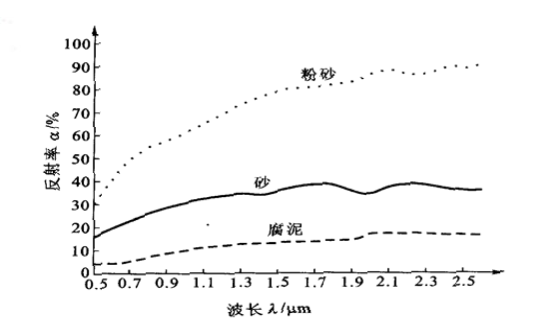

# 2024-2025学年遥感概论最后一课划重点 详细

由最后一课所划定的重点扩展而成的文档。 [@Xuuyuan](https://github.com/Xuuyuan)

## 期末试卷分值分布

卷面分共100分，三种题型。

- 【18分】 名词解释，6小题，每小题3分  
解释名词即可，无需长篇大论  
例：什么是反射率？ 反射率是什么比什么，即可。（PS：感觉这点极可能考）
- 【36分】简答题，5小题，其中一小题12分，剩下的每个6分  
简要回答。(看对应小题的分值，长度=**名词解释对应的篇幅**，约为3分)
- 【46分】论述题，2小题，第1小题题28分，第2小题18分。  
详述，一板一眼的把知道的都答上。（教师提醒：什么都不会就写对这门课的感想与感悟..）

## 第一讲 课程介绍及遥感基础

- 【重重点】反射率
  - 辐射能量W：电磁辐射的能量，单位是J。
  - 辐射通量φ: **单位时间**内通过**某一面积**的辐射能量，是辐射能流的单位，记为φ=dW/dt。
  - 辐射通量密度E：**单位时间**内通过**单位面积**的辐射能量。
  - 辐照度I：**被辐照**的物体表面单位面积上的辐射通量，记为：I=dφ/dS。单位是W/m2, S为面积。
  - 辐射出射度M：温度为T的**辐射源**物体表面单位面积上的辐射通量，记为:dφ/dS。单位也是W/m2，S为面积。
  - 辐亮度：对于某一向外发出辐射的辐射源物体，向外辐射的强度随方向存在不同。辐射亮度定义为辐射源在某一**特定方向θ，单位投影面积、单位立体角**内的辐射通量密度。
  - 黑体：如果一个物体对于任何波长的电磁辐射都全部吸收，又能全部发射，则该物体是绝对黑体。黑体的吸收率为1，反射率为0，发射率为1，与温度和波长无关。
  - 半球反射率：目标物的出射度与入射度之比值称为半球反射率，或称反照率，通常用符号ρ表示。
  - **反射率**：反射率是指地表或物体表面反射的辐射能量与入射到该表面的辐射能量之比。具体来说，**反射率是反射辐射通量与入射辐射通量的比值**。可以简单理解为：ρ=(Pρ/P0)\*100%，值域范围[0,1]
  - 影像的灰度值指标通常选择反射率
    - 反射率大 → 亮度值大 → 色调浅
    - 反射率小 → 亮度值小 → 色调深
  - 反射率的影响因素：入射光的波长、入射角的大小、地物表面粗糙度和颜色
  - 反射率体现目标信息的方法 - 反射波谱：地物的反射率随波长变化的规律
  - 反射波谱曲线：将反射波谱的变化规律绘制成的曲线
- *教学PPT解释 电磁波（也叫电磁辐射）：交互变化的电磁场在空间的传播。自然界的任何物体本身都具有发射、吸收、反射以及折射电磁波的能力。
- *另解释 电磁波：是在真空或物质中通过**传播电磁场的**震动而传输**电磁能量**的波。也称为电磁辐射。
- 【重重点】光谱曲线
  - 植物的反射光谱曲线
        
    - 可见光波段：反射率低，0.55 μm附近区间（**绿色**波段）有一个小的反射峰
    - 近红外波段：从0.76 μm处反射率迅速增大，形成一个 “陡坡” —— **红边**
    - 短波红外波段：反射率呈下降趋势，受**1.4, 1.9, 2.7um**水吸收带的影响
  - 土壤的反射光谱曲线
        
    - 自然状态下，土壤表面的反射率**呈递增趋势**，没有明显的峰值和谷值。
    - 一般来说，**土质越细反射率越高，有机质和含水量越高反射率越低**，土类与肥力也对土壤反射率有影响。
  - 水体的反射光谱曲线
        
    - 清澈水体反射率**不超过10%**，主要集中在可见光波段，在**蓝光**处有一个小的反射峰。在光谱的近红外和中红外波段，水近似于一个**“黑体”**，几乎吸收了其全部的能量。
  - 雪的反射光谱曲线
        
    - 雪虽然是水的一种固态形式，但它与水的光谱特性截然不同，地表雪被的光谱反射率明显高于自然水体。
  - 岩石的反射光谱曲线
        
    - 岩石反射曲线无统一特征，**矿物成分、矿物含量、风化程度、含水状况、颗粒大小、表面光滑度、色泽**都有影响。
    - 自然界岩石多被植被、土壤覆盖，所以与其**覆盖物**也有关。
- 【重重点】遥感：遥感是利用**传感器**主动或被动地接受地面目标**反射或发射**的**电磁波**，通过电磁波所传递的信息来识别目标，从而达到探测目标物的目的，是揭示地球表面各要素的**空间分布特征与时空变化规律**的一门**科学技术**。
- 遥感的平台
  - 地面遥感平台：是指置于地面或水上的装载传感器的固定或移动装置，它与地面或水面接触，包括三角架、遥感塔、遥感车、遥感船等，高度一般在**100m**以下，主要用于近距离测量地物波谱和摄取供试验研究用的地物细节影像，为航空遥感和航天遥感定标、校准和信息提取提供基础数据。
  - 航空遥感平台：航空平台主要指高度在**30km**以内的遥感平台与传感器，包括飞机和气球两种类型。
    - 优点：飞行高度较低；获取影像分辨率高；机动灵活；调查周期短；资料回收方便
    - 缺点：扫描范围小；成本高；资料处理困难
  - 航天平台：航天平台是指高度在**150km**以上的人造地球卫星、宇宙飞船、空间轨道站、高空探测火箭、航天飞机等遥感平台与传感器。目前对地观测中使用的航天平台主要是遥感卫星。
    - 优点：成本低；实时更新快；扫描范围大
    - 缺点：受云等影响大；空间分辨率达不到航空遥感的获取能力
- 传感器：传感器是收集、探测、记录地物电磁波辐射信息的工具。由收集器、探测器、处理器和输出器组成。传感器的性能决定遥感的能力，即传感器对电磁波段的响应能力、传感器的空间分辨率及图像的几何特征、传感器获取地物信息量的大小和可靠程度。
- 大气窗口：电磁波通过大气层时较少被反射、吸收或散射的透过率较高的波段称为大气窗口。
- 大气校正：大气的衰减作用在不同波长的影响不同，几何关系也同样影响像元灰度值，消除这些影响的过程成为大气校正，是获得地表真实反射率的至关重要的一步。
- 大气校正的方法
  - 基于图像特征的方法
  - 地面线性回归经验模型
  - 大气辐射传输理论模型
- 卫星的轨道会决定卫星的类型
  - 地球同步轨道：运行周期等于地球自转周期(23小时56分4秒)的顺行人造地球卫星轨道。不考虑轨道摄动时，在地球同步轨道上运行的卫星每天相同时刻经过地球上相同地点的上空。广泛用于气象和通讯领域。
  - 太阳同步轨道：**轨道倾角大于90度且在两极附近通过**，所以也为近极轨卫星，它的**轨道面与太阳的取向一致**，所以叫太阳同步卫星。每天向东移动0.9856度,这个角度正好是地球绕太阳公转每天东移的角度。（补充：卫星经过同一纬度任何地点的地方时相同，有利于在一段时间内获取南北极在内覆盖全球的影像）
- 同物异谱，同谱异物：没有两条完全一样的光谱曲线，同一地物的反射率变化将在某一区间变化；不同的地物在某些条件下表现出相同的光谱特征，例如，在某些波段下，草地和某些类型的灌木可能会有相似的光谱曲线。

## 第二讲 遥感数据与遥感图像

- 遥感数据传输：卫星探测 - 广播信号 - 地面接收站 - 数据处理中心 - 数据存储器 - 用户
- 遥感数据的基本格式(记录的方式)
  - BSQ (Band Sequential)：**按波段顺序记录**遥感影像数据的格式，每个波段的图像数据文件**单独形成一个影像文件**。
  - BIL (Band Interleaved by Line)：**按照波段顺序交叉排列**的遥感数据格式，每一个记录为一个波段的一条扫描线，扫描线的排列顺序是按波段顺序交叉排列的。
  - BIP (Band Interleaved by Pixel)：**按照像元顺序记录**图像数据，即在一行中按每个像元的波段顺序排列，各波段数据间交叉记录。
- 【重重点】遥感的四大分辨率
  - 空间分辨率：是指遥感影像上能够详细区分的最小单元的尺寸或大小，是用来表征影像分辨地面目标细节能力的指标。
  - 光谱分辨率：光谱分辨率是指传感器在接收目标辐射的光谱时**能分辨的最小波长间隔**。波段的波长范围越小，分辨率越高。
  - 时间分辨率：时间分辨率指**对同一目标进行遥感采样的时间间隔**，即相邻两次探测的时间间隔，也称**重返周期**。
  - 辐射分辨率：辐射分辨率是指传感器接受波谱信号时，**能分辨的最小辐射度差**。在遥感图像上表现为每一像元的辐射量化级,一般用灰度级表示，即**最暗-最亮灰度值间分级的数目—量化级数**。
- 各类分辨率之间的矛盾
  - 辐射-空间：瞬时视场角越大，空间分辨率越低，但是进入探测器的光通量越大，辐射测量越敏感，这辐射分辨率越高。反之，空间分辨率的增大将伴随辐射分辨率的降低，两者相互矛盾难以两全。
  - 时间-空间：高时间分辨率和高空间分辨率难以同时满足。
- （自行总结）四大分辨率的选择标准
  - 空间分辨率的选择：遥感器系统的空间分辨率越高，其识别物体的能力越强。但是实际上每一目标在图像的可分辨程度，不完全决定于空间分辨率的具体值，而是和它的形状、大小，以及它与周围物体亮度、结构的相对差异有关。形状和较单一的背景值在同等低分辨率下更清晰。遥感器系统空间分辨率的选择一般应选择小于被探测目标最小直径的1/2。
  - 光谱分辨率的选择：光谱分辨率越高，遥感器记录的波段数越多，波段宽度越窄，地面物体的信息区分和识别的针对性越强，对物体的识别精度越高，遥感应用分析的效果也就越好。
  - 时间分辨率的选择：根据用途的不同来决定采样的时间频率。如森林火灾监控应当以小时甚至更短计，湖泊的消长、城市的扩展则应当以年为单位。
  - 辐射分辨率的选择：任何图像目标的识别，最终依赖于探测目标和特征的亮度差异。即取决于仪器的灵敏度以及地面目标与背景间存在的对比度。
- 遥感数据呈现的方式
  - 两种基色系统
    - 加色系统 —— 其基色是红、绿、蓝 即RGB，**色光混合**（将不同颜色的光叠加在一起）
    - 减色系统 —— 其基色是黄、青、品红 即CMY，**颜料混合**（通过吸收和反射不同颜色的光来形成颜色）
  - 基础要点：眼睛看到什么颜色取决于什么颜色的光入射眼睛；物体呈现什么颜色取决于物体反射什么颜色的光。
  - 颜色模型
    - 描述颜色的三维空间坐标系，一个颜色定义为颜色空间的一个点
    - 常用的颜色模型
      - RGB（红、绿、蓝） - (Red, Green, Blue)
      - CMYK（青、品红、黄、黑） - （Cyan, Magenta, Yellow, Key(Black)）
      - IHS（亮度、色度、饱和度） - （Intensity, Hue, Saturation）
  - 黑白图像：单波段或全色波段表现为黑白图像
  - 彩色图像：三波段组合表现为彩色图像
    - 真彩色（TM321）：与真实物体相同的颜色
    - 假彩色（TM432、TM741）：图像上物体所具有的颜色，并非它本身的颜色。
    - 伪彩色（地物分类）：灰度图像的彩色表示或显示。

## 第三讲 遥感图像处理

简答题考的可能性比较大。

- 图像预处理：消除遥感图像的辐射误差和几何误差的过程。
- 辐射校正
  - 辐射误差产生的原因：传感器的响应特性、大气影响（如云、雾）、太阳辐射差异
  - 辐射定标：**辐射定标**是将传感器记录的电压或**数字值**转换成绝对**辐射亮度**的过程。
  - 【考点】大气校正
    - （自行总结）步骤：辐射定标、选择文件、设置辐射校正参数、对比前后典型地物波谱曲线
    - 直方图最小值去除法（适用于较大区域或整幅图像）：图像中辐射亮度或反射率接近0的地物，若不为0，可近似为大气散射导致的辐射值。
    - 回归分析法（适用于较小区域或局部图像）：遥感图像中，某些地物（如高山阴影区或深大水体）在各个波段的反射值理论上应为零。然而由于大气散射的影响，这些区域的反射值通常不为零。大气散射对短波长的光影响较大，而对长波长的光影响较小。因此，可以选择一个受大气影响较小的波段作为参考，通过回归分析来校正其他波段的数据。
    - 模型分析法：利用遥感影像自身的信息对遥感影像进行大气校正。
  - 太阳高度和地形校正
- 几何校正
  - 几何形变产生的原因
    - 传感器外方位元素变化
    - 地表起伏的影响
    - 地表曲率的影响
    - 大气折射的影响
  - 多项式校正：适合在地形平坦、不需要高程信息或地面起伏较大而无高程信息的区域
    - 计算方法：最邻近法、双线性内插法、三次卷积内插
- 图像增强
  - 目的：增强目视效果、提高图像质量、突出所需信息
  - 方法：对比度变换、空间滤波、彩色变换、图像运算、多光谱变换
- 图像的彩色合成与变换
  - 真彩色合成：影像的颜色与地物颜色基本一致
  - 假彩色合成：影像的色调与实际地物色调不一致
  - 伪彩色合成：单色波段的图像分割间隔赋予不同颜色进行彩色显示
- 【考点】空间域增强
  - 平滑
    - 目的：去除图像噪声
    - 基本思想：是将每个像元在以其为中心的区域内，取一定像元的平均值来代替该像元的值，从而平滑图像细节，降低图像反差。
  - 锐化
    - 锐化是平滑的相反增强处理方法，它增强图像中的高频成分，在频域处理中称为高通滤波，也就是使图像边缘、线状目标地物，或某些亮度变化大的区域，更加突出出来，也称边缘增强（检测）。
- 光谱变换与增强

## 第四讲 遥感图像解译和分类

- 遥感图像解译：是通过遥感图像所提供的各种识别目标的特征信息进行分析、推断与判断，最终达到识别目标或现象的目的。
- 信息提取：依据遥感图像上的地物特征，识别地物类型、性质、空间位置、形状、大小等属性的过程
- 信息提取的方法：目视判读法、计算机分类法（监督分类、非监督分类、模式识别、神经网络分类等）
- 判读标志：在遥感图像上能具体反映和判断地物或现象的影像特征。包括色彩、形状、大小、阴影、位置、组合图案等。
- 目视解译的方法：直接判读法、对比分析法、量测法、逻辑推理法、历史对比法
- 计算机分类
  - 概念：利用模式识别技术对遥感图像上的像元进行属性的识别和分类的过程，是一种智能化的图像判读手段。
  - 基本过程
    - 根据图像分类目的选取特定区域的遥感数字图像，需考虑图像的空间分辨率、光谱分辨率、成像时间、图像质量等。
    - 根据研究区域，收集与分析地面参考信息与有关数据。
    - 根据分类要求和图像数据的特征，选择合适的图像分类方法和算法。制定分类系统，确定分类类别。
    - 找出代表这些类别的统计特征（均值）。
    - 为了测定总体特征，在监督分类中可选择具有代表性的训练场地进行采样，测定其特征。在非监督分类中，可用聚类等方法对特征相似的像素进行归类，测定其特征。
    - 对遥感图像中像素进行分类。
    - 分类精度检查。
    - 对判别分析的结果进行统计检验。
  - 【考点】分类
    - 监督分类
      - 概念：先需要从研究区域选取具有代表性的训练场地作为样本，根据已知训练区提供的样本，选择特征参数，建立判别函数，据此对样本像元进行分类。然后依据样本类别的特征来识别非样本像元的属性类别。简单来讲，**是用已知类别的样本对未知类别的像元进行分类的过程**。
      - 方法：平等算法分类、最小距离分类、ISODATA算法分类、最大似然法分类、贝叶斯法分类、ECHO分类法
      - 优点：可控制训练样区和训练样本的选择、不必担心光谱类别和信息类别的匹配问题
      - 缺点：分类体系的选择有主观因素影响、只能识别训练样本定义的类别，可能造成遗漏
      - 一般步骤
        - 确定分类的类别列表
        - 选择和确定训练数据
        - 修改类别和训练样区，确保训练数据的均质性
        - 实施分类
        - 评估分类效果
    - 非监督分类
      - 概念：在没有先验类别（训练场地）作为样本的条件下，即事先不知道类别特征，主要根据像元间相似度的大小进行归类合并（即相似度的像元归为一类）的方法。
      - 方法：K-Means、ISODATA、链状方法
      - 优点：不需要对所要分类的区域有广泛了解、避免人为误差
      - 缺点：光谱类别的解译识别工作量大且复杂、很难控制分类产生的类别
      - 一般步骤
        - 确定分类数量
        - 选择集群类别中心点
        - 计算机处理运算类别中心点
        - 计算机像元归类
        - 计算机重新分类
    - 分类的后处理：对面积很小的图斑进行剔除。处理方法：聚类统计、过滤分析、去除分析、分类重编码
    - 精度评价方法：面积精度评价法、位置精度评价法、误差矩阵评价法
    - 影响图像分类的因素：未能充分利用遥感图像的多种信息、提高遥感图像分类精度受到限制、（后为计算机分类效果）正确选择特征变量、优化训练区、充分利用影像空间信息

## 植被遥感专题

论述题其中一题来自此处。

- 植被：生长在一定区域内的植物覆盖，是该区域所有植物群落及其时空配置的总和。
- 植被指数：运用**多光谱遥感数据**经分析运算（加、减、乘、除等线性或非线性组合方式）产生某些对植被长势、生物量等有一定**指示意义**的数值。
- 植被指数的种类、公式、作用
  - 归一化植被指数 NDVI
    - NDVI是监测地区或全球植被和生态环境变化的有效指标。
    - 
  - 增强性植被指数 EVI
    - EVI是克服NDVI高植被区易饱和、低植被区易受土壤背景影响的缺点而引入蓝光波段，降低了大气的影响的植被指数。
    - 
  - 调整土壤亮度的植被指数 SAVI
    - SAVI是为了解释背景的光学特征变化并修正NDVI对土壤背景的敏感而提出的可适当描述土壤-植被系统的简单模型。
    - 
- 冠层
  - 冠层是指植被枝叶的稠密顶层，也是最容易被遥感探测到的部分，叶片是冠层最重要的组成部分。
  - 由叶片到冠层需要额外考虑：冠层结构、叶倾角分布、太阳-目标-观测的角度、土壤背景、林下植被等因素。
- 【重重点】冠层的植被参数
  - 结构参数-叶面积指数 LAI：单位水平面上，所有绿色叶片面积的一半
  - 结构参数-聚集度指数 CI：反应叶片在空间中的分布情况
  - 有效叶面积指数 / 聚集度指数 = 真实叶面积指数
  - 生化参数-叶片叶绿素含量：单位叶片面积对应的叶绿素含量 或 单位叶片重量对应的叶绿素含量
- 【重重点】（自行总结）如何用遥感数据对参数进行反演
  - 经验模型法（简单易行，但模型的普适性较差。常见模型：NDVI、EVI等植被指数与LAI的经验关系）
  - 物理模型法（普适性较强，但模型复杂、参数较多。常见模型：PROSAIL、FLIGHT）
  - 机器学习方法（具有较强自适应性，但需要大量训练数据。常见算法：支持向量机、神经网络）
- 【重重点】（自行总结）遥感的底层观点
  - 行为趋势: 遥感通过长时间序列的影像数据，可以观测和分析地表现象随时间的变化趋势，如植被生长、城市扩张、冰川消退等。
  - 病态反演: 病态反演是指遥感反演过程中，由于观测数据不足或模型复杂性导致的解不稳定或不唯一的问题。在这种情况下，微小的观测误差会导致反演结果的巨大变化。（夕阳返照桃花渡，柳絮飞来片片红 —— 先验知识）
  - 尺度效应: 尺度效应是指在不同空间分辨率下，遥感数据所反映的地表特征和参数存在差异的现象。这种差异是由于地表的非均质性和遥感模型的非线性导致的。（不识庐山真面目，只缘身在此山中 —— 遥感影像分辨率）
- 【重重点】（自行总结）遥感应用的实例
  - 植被覆盖度监测: 通过计算NDVI等植被指数，监测植被覆盖度的变化，评估生态环境质量。
  - 森林生物量估算: 利用遥感数据，结合实地测量数据，建立模型估算森林生物量，为碳排放估算提供依据。
  - 农业监测: 监测农作物生长状况、估算产量，为农业生产提供决策支持。
  - 水资源监测: 监测水体面积、水质变化，为水资源管理提供信息。
  - 灾害监测: 监测火灾、洪水、干旱等自然灾害，为灾害评估和应急响应提供支持。
  - 【重重点】植被遥感的应用：农业遥感
    - 主要领域：农业资源清查与变化分析、农业灾害监测与预警、农情遥感监测、精准农业遥感
    - 划分：大尺度**全球农业遥感**（利用遥感大数据，为农业政策制定提供宏观信息支持）、小尺度**精准农业遥感**（以信息技术为支撑，将高分辨率遥感数据应用到精准农业生产环节的技术手段）
    - 案例：CropWatch全球农情速报系统、作物单产估算
- 【重重点】（AI总结）李小文院士的观点 / 思政部分
  - 几何光学模型：李小文院士创建了植被二向性反射的Li-Strahler几何光学模型，奠定了地物二向性反射研究中几何光学学派的基础。这一模型在描述森林结构的方向性反射特征及反射热点方面取得了突破。
  - 病态反演理论：他强调在遥感反演过程中，由于观测数据的局限性和模型的复杂性，常常会出现病态反演问题，即解的不稳定性和不唯一性。他提倡通过引入先验知识和多源数据融合来解决这一问题。
  - 尺度效应研究：李小文院士在赫姆霍兹互易原理和普朗克定律在地表遥感中的适用性方面进行了深入研究，提出了非均一像元二向性反射的约束条件和非同温地表热辐射的尺度修正式。他认为尺度问题是地学与遥感科学交叉的重要问题。

## 参考资料

1. 5份教学课件
2. 最后一课所划定的重点